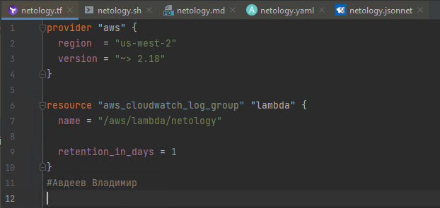
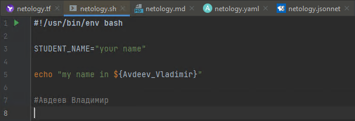
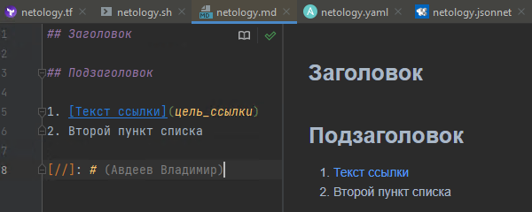
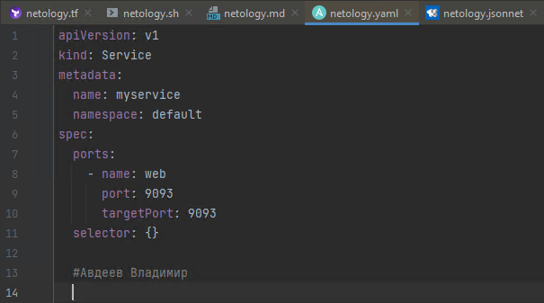
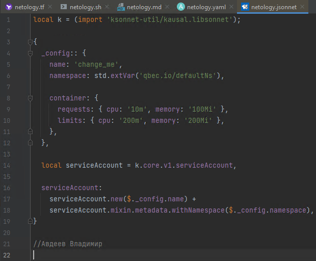

## Задание №1
1. Добавите свое имя в каждый файл и сделать снимок экрана.
    - Terraform:  
    - Bash:  
    - Markdown:  
    - Yaml:  
    - Jsonnet:  
 ## Задание №2 - Описание жизненного цикла задачи
1.	Планирование
 На этапе планирования Менеджер проекта согласовывает и документирует техническое задание с учетом:
  -требований заказчика
  -требований и спецификаций используемого ПО
  -требований используемой инфраструктуры
 Менеджер передает техническое задание на разработку.
 Команда составляет приблизительную картину процесса разработки.
 Роль DevOps-а на этапе планирования заключается в выборе оптимальной варианта развертывания инфраструктуры и помощи выбора инструментов разработки.
2.	 Разработка
 На этом этапе разработчики создают и тестируют исходный код и разрабатывают новые и улучшенные функции. Разработчики часто используют локальные рабочие станции для реализации «внутреннего цикла» создания и тестирования исходного кода, прежде чем он будет отправлен на следующий этап.
 Роль DevOps-а на этапе разработки заключается в настройке для всей команды идентичной среды разработки так же настройке контроля версий, настройке инфраструктуры для среды разработки, тестирования, а также для продакшена.
3.	Сборка
 На данном этапе новый код интегрируется в существующую базу исходного кода, тестируется авто тестами и компонуется в виде исполняемого файла для развертывания. К типичным операциям автоматизации относятся объединение изменений в коде в копию для тестирования команде QA, извлечение кода из репозитория и автоматизация процессов компиляции, модульного тестирования и сборки исполняемого файла.
 Роль DevOps-а автоматизация сборки и развертывания кода на тестовую инфраструктуру, написание авто тестов.
4.	Тестирование
 На этапе тестирования разрабатываемое программное обеспечение проверяется командой QA на наличие ошибок и соответствие техническому заданию. При наличии необходимости и выявлении ошибок оформляют задание на доработку проект возвращается на этап разработки.
5.	Развертывание
 Развертывание кода в продакшен среде для дальнейшего использования. Это выполняется таким образом, что любые внесенные изменения не должны влиять на функционирование продукта с высокой посещаемостью.
Роль DevOps-а контроль и автоматизация сборки и развертывания кода на продакшен инфраструктуре. На продакшен не должен выйти не рабочий код. При возникновение критических проблем откатываем к предыдущей версии продукта.
6.	Мониторинг
 На данном этапе контролируем производительность продукта в соответствии с требованиями клиента. Вносим изменения в инфраструктуру, если таковые имеются, чтобы удовлетворить потребности клиентов.
 Роль DevOps-а в настройка средств мониторинга метрик и логирования.
