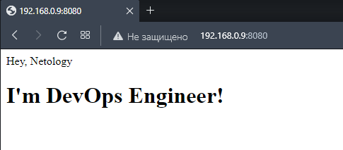

# Домашнее задание к занятию "5.3. Введение. Экосистема. Архитектура. Жизненный цикл Docker контейнера"

## Задача 1

Сценарий выполнения задачи:

- создайте свой репозиторий на https://hub.docker.com;
- выберете любой образ, который содержит веб-сервер Nginx;
- создайте свой fork образа;
- реализуйте функциональность:
запуск веб-сервера в фоне с индекс-страницей, содержащей HTML-код ниже:
```
<html>
<head>
Hey, Netology
</head>
<body>
<h1>I’m DevOps Engineer!</h1>
</body>
</html>
```
Опубликуйте созданный форк в своем репозитории и предоставьте ответ в виде ссылки на https://hub.docker.com/username_repo.


Ответ:  
Ссылка на репозиторий  
https://hub.docker.com/r/avdeevvl/nginx

Файлы:

[Dockerfile](./src/nginx/Dockerfile)  
[Index.html](./src/nginx/index.html)

Логи выполнения:

[Dockerfile](./src/nginx/Dockerfile)
```dockerfile
FROM nginx:latest
COPY ./index.html /usr/share/nginx/html/index.html
```
Собираем образа из [Dockerfile](./src/nginx/Dockerfile)

```sh
gips@UD22:~/nginx$ docker build -t avdeevvl/nginx .
Sending build context to Docker daemon  4.096kB
Step 1/2 : FROM nginx:latest
 ---> 2b7d6430f78d
Step 2/2 : COPY ./index.html /usr/share/nginx/html/index.html
 ---> 927156d9252b
Successfully built 927156d9252b
Successfully tagged avdeevvl/nginx:latest
```
Запускаем

```sh
gips@UD22:~/nginx$ docker run -it -d -p 8080:80 --name nginx avdeevvl/nginx
ac2627ef314681a8f65f5b758d139be1f76d10f77432756fd02662d3df34f6ec
```
Проверяем  
<p align="center">
  
</p>  
  
```sh
gips@UD22:~/nginx$ docker ps
CONTAINER ID   IMAGE            COMMAND                  CREATED              STATUS              PORTS                                   NAMES
ac2627ef3146   avdeevvl/nginx   "/docker-entrypoint.…"   About a minute ago   Up About a minute   0.0.0.0:8080->80/tcp, :::8080->80/tcp   nginx
```

```sh
gips@UD22:~/nginx$ docker image ls
REPOSITORY       TAG       IMAGE ID       CREATED         SIZE
avdeevvl/nginx   latest    927156d9252b   2 minutes ago   142MB
nginx            latest    2b7d6430f78d   2 weeks ago     142MB
hello-world      latest    feb5d9fea6a5   11 months ago   13.3kB
```

Присваиваем тег  

```sh
gips@UD22:~/nginx$ docker tag 927156d9252b avdeevvl/nginx:1.0
```

```sh
gips@UD22:~/nginx$ docker image ls
REPOSITORY       TAG       IMAGE ID       CREATED         SIZE
avdeevvl/nginx   1.0       927156d9252b   2 minutes ago   142MB
avdeevvl/nginx   latest    927156d9252b   2 minutes ago   142MB
nginx            latest    2b7d6430f78d   2 weeks ago     142MB
hello-world      latest    feb5d9fea6a5   11 months ago   13.3kB
```
Авторизовываемся на DockerHub

```sh
gips@UD22:~/nginx$ docker login -u avdeevvl
Password: 
WARNING! Your password will be stored unencrypted in /home/gips/.docker/config.json.
Configure a credential helper to remove this warning. See
https://docs.docker.com/engine/reference/commandline/login/#credentials-store

Login Succeeded
```

Отправляем в DockerHub

```sh
gips@UD22:~/nginx$ docker push avdeevvl/nginx:1.0
The push refers to repository [docker.io/avdeevvl/nginx]
ab226bc2fd8a: Pushed 
73993eeb8aa2: Mounted from library/nginx 
2c31eef17db8: Mounted from library/nginx 
7b9055fc8058: Mounted from library/nginx 
04ab349b7b3b: Mounted from library/nginx 
226117031573: Mounted from library/nginx 
6485bed63627: Mounted from library/nginx 
1.0: digest: sha256:bc53eb98ff5ac58f9e9eb4ab856669bcc1aa7e11464510bb0346cf6cc51ce8bb size: 1777
gips@UD22:~/nginx$ 
```

## Задача 2

Посмотрите на сценарий ниже и ответьте на вопрос:
"Подходит ли в этом сценарии использование Docker контейнеров или лучше подойдет виртуальная машина, физическая машина? Может быть возможны разные варианты?"

Детально опишите и обоснуйте свой выбор.

--

Сценарий:

- Высоконагруженное монолитное java веб-приложение;
- Nodejs веб-приложение;
- Мобильное приложение c версиями для Android и iOS;
- Шина данных на базе Apache Kafka;
- Elasticsearch кластер для реализации логирования продуктивного веб-приложения - три ноды elasticsearch, два logstash и две ноды kibana;
- Мониторинг-стек на базе Prometheus и Grafana;
- MongoDB, как основное хранилище данных для java-приложения;
- Gitlab сервер для реализации CI/CD процессов и приватный (закрытый) Docker Registry.


Ответ:  
- Высоконагруженное монолитное java веб-приложение;  
Физический сервер или виртуальная машина предпочтительнее, т.к. монолитное и на микросервисы сложно разбить. К тому же необходим прямой доступ к ресурсам.

- Nodejs веб-приложение;  
Docker контейнер, т.к. не требуется много ресурсов и удобно обновлять, быстрое развертывание с нужными зависимостями.

- Мобильное приложение c версиями для Android и iOS;  
Виртуальная машина так как потребуется GUI для разработки.

- Шина данных на базе Apache Kafka;  
Докер идеально подходит. Кластеризация и  масштабирование, позволяет быстро разворачивать новые ноды.

- Elasticsearch кластер для реализации логирования продуктивного веб-приложения - три ноды elasticsearch, два logstash и две ноды kibana;   
Докер подходит для кластеризации и масштабирования.

- Мониторинг-стек на базе Prometheus и Grafana;  
Докер. Данный стек не требователен к ресурсам. Контейнеризация позволит легко его масштабировать.

- MongoDB, как основное хранилище данных для java-приложения;
Докер подключить источники постоянных данных через volume подходит для тестовой среды. Для продакшена рекомендованы варианты развертывания на виртуальной машине или физическом сервере.

- Gitlab сервер для реализации CI/CD процессов и приватный (закрытый) Docker Registry.
На виртуальной машине. Требовательность по ресурсам надежность хранения данных и легкость резервного копирования и репликации.


## Задача 3

- Запустите первый контейнер из образа ***centos*** c любым тэгом в фоновом режиме, подключив папку ```/data``` из текущей рабочей директории на хостовой машине в ```/data``` контейнера;
- Запустите второй контейнер из образа ***debian*** в фоновом режиме, подключив папку ```/data``` из текущей рабочей директории на хостовой машине в ```/data``` контейнера;
- Подключитесь к первому контейнеру с помощью ```docker exec``` и создайте текстовый файл любого содержания в ```/data```;
- Добавьте еще один файл в папку ```/data``` на хостовой машине;
- Подключитесь во второй контейнер и отобразите листинг и содержание файлов в ```/data``` контейнера.


Ответ:  

- Запускаем первый контейнер из образа ***centos*** в фоновом режиме, подключив папку ```/data``` из текущей рабочей директории на хостовой машине в ```/data``` контейнера;

```sh
gips@UD22:~$ docker run -it -d -v /data:/data --name centos centos
Unable to find image 'centos:latest' locally
latest: Pulling from library/centos
a1d0c7532777: Pull complete 
Digest: sha256:a27fd8080b517143cbbbab9dfb7c8571c40d67d534bbdee55bd6c473f432b177
Status: Downloaded newer image for centos:latest
834b4fe88d4e9df2ff1d363f489012a73ce6b87c105d04be196dc47585322463
```

- Запускаем второй контейнер из образа ***debian*** в фоновом режиме, подключив папку ```/data``` из текущей рабочей директории на хостовой машине в ```/data``` контейнера;

```sh
gips@UD22:~$ docker run -it -d -v /data:/data --name debian debian
Unable to find image 'debian:latest' locally
latest: Pulling from library/debian
1671565cc8df: Pull complete 
Digest: sha256:d52921d97310d0bd48dab928548ef539d5c88c743165754c57cfad003031386c
Status: Downloaded newer image for debian:latest
03722cd73115d05d2fdbd1dc3f6559c05e77806e7064b757bde47d1bceb0b20c
```
- Проверяем:

```sh
gips@UD22:~$ docker ps
CONTAINER ID   IMAGE     COMMAND       CREATED          STATUS          PORTS     NAMES
03722cd73115   debian    "bash"        32 seconds ago   Up 30 seconds             debian
834b4fe88d4e   centos    "/bin/bash"   49 seconds ago   Up 46 seconds             centos
```

- Подключаемся к первому контейнеру с помощью ```docker exec``` и создаем текстовый файл ***netology_centos.txt*** в ```/data```;

```sh
gips@UD22:~$ docker exec -it centos bash
[root@834b4fe88d4e /]# touch /data/netology_centos.txt
[root@834b4fe88d4e /]# exit
exit
```
- Добавляем еще один файл ***netology_host.txt*** в папку ```/data``` на хостовой машине:  
`sudo touch /data/netology_host.txt`

- Подключаемся во второй контейнер и отобразим листинг и содержание файлов в ```/data``` контейнера.

```sh
gips@UD22:~$ docker exec -it debian bash
root@03722cd73115:/# ls /data
netology_centos.txt  netology_host.txt
root@03722cd73115:/# exit
exit
```

## Задача 4 (*) 

Воспроизвести практическую часть лекции самостоятельно.

Соберите Docker образ с Ansible, загрузите на Docker Hub и пришлите ссылку вместе с остальными ответами к задачам.

Ответ:  
Ссылка на репозиторий  
https://hub.docker.com/r/avdeevvl/ansible

[Dockerfile](.\src\build\ansible\Dockerfile)  

<details>
<summary>Собираем образа из Dockerfile</summary>

```sh
gips@UD22:~/ansible$ docker build -t avdeevvl/ansible:2.10.0 .
Sending build context to Docker daemon  3.072kB
Step 1/5 : FROM alpine:3.14
3.14: Pulling from library/alpine
c7ed990a2339: Pull complete 
Digest: sha256:1ab24b3b99320975cca71716a7475a65d263d0b6b604d9d14ce08f7a3f67595c
Status: Downloaded newer image for alpine:3.14
 ---> dd53f409bf0b
Step 2/5 : RUN CARGO_NET_GIT_FETCH_WITH_CLI=1 &&     apk --no-cache add         sudo         python3        py3-pip         openssl         ca-certificates         sshpass         openssh-client         rsync         git &&     apk --no-cache add --virtual build-dependencies         python3-dev         libffi-dev         musl-dev         gcc         cargo         openssl-dev         libressl-dev         build-base &&     pip install --upgrade pip wheel &&     pip install --upgrade cryptography cffi &&     pip uninstall ansible-base &&     pip install ansible-core &&     pip install ansible==2.10.0 &&     pip install mitogen ansible-lint jmespath &&     pip install --upgrade pywinrm &&     apk del build-dependencies &&     rm -rf /var/cache/apk/* &&     rm -rf /root/.cache/pip &&     rm -rf /root/.cargo
 ---> Running in d271644ae540
fetch https://dl-cdn.alpinelinux.org/alpine/v3.14/main/x86_64/APKINDEX.tar.gz
fetch https://dl-cdn.alpinelinux.org/alpine/v3.14/community/x86_64/APKINDEX.tar.gz
(1/55) Installing ca-certificates (20220614-r0)
(2/55) Installing brotli-libs (1.0.9-r5)
(3/55) Installing nghttp2-libs (1.43.0-r0)
(4/55) Installing libcurl (7.79.1-r3)
(5/55) Installing expat (2.4.7-r0)
(6/55) Installing pcre2 (10.36-r1)
(7/55) Installing git (2.32.3-r0)
(8/55) Installing openssh-keygen (8.6_p1-r3)
(9/55) Installing ncurses-terminfo-base (6.2_p20210612-r1)
(10/55) Installing ncurses-libs (6.2_p20210612-r1)
(11/55) Installing libedit (20210216.3.1-r0)
(12/55) Installing openssh-client-common (8.6_p1-r3)
(13/55) Installing openssh-client-default (8.6_p1-r3)
(14/55) Installing openssl (1.1.1q-r0)
(15/55) Installing libbz2 (1.0.8-r1)
(16/55) Installing libffi (3.3-r2)
(17/55) Installing gdbm (1.19-r0)
(18/55) Installing xz-libs (5.2.5-r1)
(19/55) Installing libgcc (10.3.1_git20210424-r2)
(20/55) Installing libstdc++ (10.3.1_git20210424-r2)
(21/55) Installing mpdecimal (2.5.1-r1)
(22/55) Installing readline (8.1.0-r0)
(23/55) Installing sqlite-libs (3.35.5-r0)
(24/55) Installing python3 (3.9.5-r2)
(25/55) Installing py3-appdirs (1.4.4-r2)
(26/55) Installing py3-chardet (4.0.0-r2)
(27/55) Installing py3-idna (3.2-r0)
(28/55) Installing py3-urllib3 (1.26.5-r0)
(29/55) Installing py3-certifi (2020.12.5-r1)
(30/55) Installing py3-requests (2.25.1-r4)
(31/55) Installing py3-msgpack (1.0.2-r1)
(32/55) Installing py3-lockfile (0.12.2-r4)
(33/55) Installing py3-cachecontrol (0.12.6-r1)
(34/55) Installing py3-colorama (0.4.4-r1)
(35/55) Installing py3-contextlib2 (0.6.0-r1)
(36/55) Installing py3-distlib (0.3.1-r3)
(37/55) Installing py3-distro (1.5.0-r3)
(38/55) Installing py3-six (1.15.0-r1)
(39/55) Installing py3-webencodings (0.5.1-r4)
(40/55) Installing py3-html5lib (1.1-r1)
(41/55) Installing py3-parsing (2.4.7-r2)
(42/55) Installing py3-packaging (20.9-r1)
(43/55) Installing py3-toml (0.10.2-r2)
(44/55) Installing py3-pep517 (0.10.0-r2)
(45/55) Installing py3-progress (1.5-r2)
(46/55) Installing py3-retrying (1.3.3-r1)
(47/55) Installing py3-ordered-set (4.0.2-r1)
(48/55) Installing py3-setuptools (52.0.0-r3)
(49/55) Installing py3-pip (20.3.4-r1)
(50/55) Installing libacl (2.2.53-r0)
(51/55) Installing popt (1.18-r0)
(52/55) Installing zstd-libs (1.4.9-r1)
(53/55) Installing rsync (3.2.4-r0)
(54/55) Installing sshpass (1.09-r0)
(55/55) Installing sudo (1.9.7_p1-r1)
Executing busybox-1.33.1-r8.trigger
Executing ca-certificates-20220614-r0.trigger
OK: 98 MiB in 69 packages
fetch https://dl-cdn.alpinelinux.org/alpine/v3.14/main/x86_64/APKINDEX.tar.gz
fetch https://dl-cdn.alpinelinux.org/alpine/v3.14/community/x86_64/APKINDEX.tar.gz
(1/37) Installing pkgconf (1.7.4-r0)
(2/37) Installing python3-dev (3.9.5-r2)
(3/37) Installing linux-headers (5.10.41-r0)
(4/37) Installing libffi-dev (3.3-r2)
(5/37) Installing musl-dev (1.2.2-r3)
(6/37) Installing binutils (2.35.2-r2)
(7/37) Installing libgomp (10.3.1_git20210424-r2)
(8/37) Installing libatomic (10.3.1_git20210424-r2)
(9/37) Installing libgphobos (10.3.1_git20210424-r2)
(10/37) Installing gmp (6.2.1-r1)
(11/37) Installing isl22 (0.22-r0)
(12/37) Installing mpfr4 (4.1.0-r0)
(13/37) Installing mpc1 (1.2.1-r0)
(14/37) Installing gcc (10.3.1_git20210424-r2)
(15/37) Installing rust-stdlib (1.52.1-r1)
(16/37) Installing libxml2 (2.9.14-r1)
(17/37) Installing llvm11-libs (11.1.0-r2)
(18/37) Installing http-parser (2.9.4-r0)
(19/37) Installing pcre (8.44-r0)
(20/37) Installing libssh2 (1.9.0-r1)
(21/37) Installing libgit2 (1.1.0-r2)
(22/37) Installing rust (1.52.1-r1)
(23/37) Installing cargo (1.52.1-r1)
(24/37) Installing openssl-dev (1.1.1q-r0)
(25/37) Installing libressl3.3-libcrypto (3.3.6-r0)
(26/37) Installing libressl3.3-libssl (3.3.6-r0)
(27/37) Installing libressl3.3-libtls (3.3.6-r0)
(28/37) Installing libressl-dev (3.3.6-r0)
(29/37) Installing libmagic (5.40-r1)
(30/37) Installing file (5.40-r1)
(31/37) Installing libc-dev (0.7.2-r3)
(32/37) Installing g++ (10.3.1_git20210424-r2)
(33/37) Installing make (4.3-r0)
(34/37) Installing fortify-headers (1.1-r1)
(35/37) Installing patch (2.7.6-r7)
(36/37) Installing build-base (0.5-r3)
(37/37) Installing build-dependencies (20220906.091008)
Executing busybox-1.33.1-r8.trigger
OK: 1110 MiB in 106 packages
Requirement already satisfied: pip in /usr/lib/python3.9/site-packages (20.3.4)
Collecting pip
  Downloading pip-22.2.2-py3-none-any.whl (2.0 MB)
Collecting wheel
  Downloading wheel-0.37.1-py2.py3-none-any.whl (35 kB)
Installing collected packages: wheel, pip
  Attempting uninstall: pip
    Found existing installation: pip 20.3.4
    Uninstalling pip-20.3.4:
      Successfully uninstalled pip-20.3.4
Successfully installed pip-22.2.2 wheel-0.37.1
Collecting cryptography
  Downloading cryptography-37.0.4-cp36-abi3-musllinux_1_1_x86_64.whl (4.2 MB)
     ━━━━━━━━━━━━━━━━━━━━━━━━━━━━━━━━━━━━━━━━ 4.2/4.2 MB 7.7 MB/s eta 0:00:00
Collecting cffi
  Downloading cffi-1.15.1-cp39-cp39-musllinux_1_1_x86_64.whl (463 kB)
     ━━━━━━━━━━━━━━━━━━━━━━━━━━━━━━━━━━━━━━ 463.1/463.1 kB 17.6 MB/s eta 0:00:00
Collecting pycparser
  Downloading pycparser-2.21-py2.py3-none-any.whl (118 kB)
     ━━━━━━━━━━━━━━━━━━━━━━━━━━━━━━━━━━━━━━ 118.7/118.7 kB 20.1 MB/s eta 0:00:00
Installing collected packages: pycparser, cffi, cryptography
Successfully installed cffi-1.15.1 cryptography-37.0.4 pycparser-2.21
WARNING: Running pip as the 'root' user can result in broken permissions and conflicting behaviour with the system package manager. It is recommended to use a virtual environment instead: https://pip.pypa.io/warnings/venv
WARNING: Skipping ansible-base as it is not installed.
WARNING: Running pip as the 'root' user can result in broken permissions and conflicting behaviour with the system package manager. It is recommended to use a virtual environment instead: https://pip.pypa.io/warnings/venv
Collecting ansible-core
  Downloading ansible_core-2.13.3-py3-none-any.whl (2.1 MB)
     ━━━━━━━━━━━━━━━━━━━━━━━━━━━━━━━━━━━━━━━━ 2.1/2.1 MB 3.6 MB/s eta 0:00:00
Collecting PyYAML>=5.1
  Downloading PyYAML-6.0.tar.gz (124 kB)
     ━━━━━━━━━━━━━━━━━━━━━━━━━━━━━━━━━━━━━ 125.0/125.0 kB 781.4 kB/s eta 0:00:00
  Installing build dependencies: started
  Installing build dependencies: finished with status 'done'
  Getting requirements to build wheel: started
  Getting requirements to build wheel: finished with status 'done'
  Preparing metadata (pyproject.toml): started
  Preparing metadata (pyproject.toml): finished with status 'done'
Collecting resolvelib<0.9.0,>=0.5.3
  Downloading resolvelib-0.8.1-py2.py3-none-any.whl (16 kB)
Collecting jinja2>=3.0.0
  Downloading Jinja2-3.1.2-py3-none-any.whl (133 kB)
     ━━━━━━━━━━━━━━━━━━━━━━━━━━━━━━━━━━━━━━ 133.1/133.1 kB 24.9 MB/s eta 0:00:00
Requirement already satisfied: cryptography in /usr/lib/python3.9/site-packages (from ansible-core) (37.0.4)
Requirement already satisfied: packaging in /usr/lib/python3.9/site-packages (from ansible-core) (20.9)
Collecting MarkupSafe>=2.0
  Downloading MarkupSafe-2.1.1-cp39-cp39-musllinux_1_1_x86_64.whl (29 kB)
Requirement already satisfied: cffi>=1.12 in /usr/lib/python3.9/site-packages (from cryptography->ansible-core) (1.15.1)
Requirement already satisfied: pycparser in /usr/lib/python3.9/site-packages (from cffi>=1.12->cryptography->ansible-core) (2.21)
Building wheels for collected packages: PyYAML
  Building wheel for PyYAML (pyproject.toml): started
  Building wheel for PyYAML (pyproject.toml): finished with status 'done'
  Created wheel for PyYAML: filename=PyYAML-6.0-cp39-cp39-linux_x86_64.whl size=45331 sha256=82d7ba2635dc99fa5c4ef6d5da1ba5d3281731c1a94c2afc849a6922c0be7fbd
  Stored in directory: /root/.cache/pip/wheels/b4/0f/9a/d6af48581dda678920fccfb734f5d9f827c6ed5b4074c7eda8
Successfully built PyYAML
Installing collected packages: resolvelib, PyYAML, MarkupSafe, jinja2, ansible-core
Successfully installed MarkupSafe-2.1.1 PyYAML-6.0 ansible-core-2.13.3 jinja2-3.1.2 resolvelib-0.8.1
WARNING: Running pip as the 'root' user can result in broken permissions and conflicting behaviour with the system package manager. It is recommended to use a virtual environment instead: https://pip.pypa.io/warnings/venv
Collecting ansible==2.10.0
  Downloading ansible-2.10.0.tar.gz (25.5 MB)
     ━━━━━━━━━━━━━━━━━━━━━━━━━━━━━━━━━━━━━━━━ 25.5/25.5 MB 9.8 MB/s eta 0:00:00
  Preparing metadata (setup.py): started
  Preparing metadata (setup.py): finished with status 'done'
Collecting ansible-base<2.11,>=2.10.1
  Downloading ansible-base-2.10.17.tar.gz (6.1 MB)
     ━━━━━━━━━━━━━━━━━━━━━━━━━━━━━━━━━━━━━━━━ 6.1/6.1 MB 10.5 MB/s eta 0:00:00
  Preparing metadata (setup.py): started
  Preparing metadata (setup.py): finished with status 'done'
Requirement already satisfied: jinja2 in /usr/lib/python3.9/site-packages (from ansible-base<2.11,>=2.10.1->ansible==2.10.0) (3.1.2)
Requirement already satisfied: PyYAML in /usr/lib/python3.9/site-packages (from ansible-base<2.11,>=2.10.1->ansible==2.10.0) (6.0)
Requirement already satisfied: cryptography in /usr/lib/python3.9/site-packages (from ansible-base<2.11,>=2.10.1->ansible==2.10.0) (37.0.4)
Requirement already satisfied: packaging in /usr/lib/python3.9/site-packages (from ansible-base<2.11,>=2.10.1->ansible==2.10.0) (20.9)
Requirement already satisfied: cffi>=1.12 in /usr/lib/python3.9/site-packages (from cryptography->ansible-base<2.11,>=2.10.1->ansible==2.10.0) (1.15.1)
Requirement already satisfied: MarkupSafe>=2.0 in /usr/lib/python3.9/site-packages (from jinja2->ansible-base<2.11,>=2.10.1->ansible==2.10.0) (2.1.1)
Requirement already satisfied: pycparser in /usr/lib/python3.9/site-packages (from cffi>=1.12->cryptography->ansible-base<2.11,>=2.10.1->ansible==2.10.0) (2.21)
Building wheels for collected packages: ansible, ansible-base
  Building wheel for ansible (setup.py): started
  Building wheel for ansible (setup.py): finished with status 'done'
  Created wheel for ansible: filename=ansible-2.10.0-py3-none-any.whl size=43068828 sha256=7811fe360a9cc80ee2e2bea92bb8b91f3f569b33b5c906624b08241ff12eee51
  Stored in directory: /root/.cache/pip/wheels/5c/ab/85/c81eaaeaf7239a38ab4eceea7cec8d110618aee6887b2491d3
  Building wheel for ansible-base (setup.py): started
  Building wheel for ansible-base (setup.py): finished with status 'done'
  Created wheel for ansible-base: filename=ansible_base-2.10.17-py3-none-any.whl size=1880365 sha256=d9bbe456bde9755a152b672195bee5558298950461c17e4884946660bcc5fa8d
  Stored in directory: /root/.cache/pip/wheels/77/01/15/0d4b716065c1270fd0b9c28e5bd44d5fd907c43a85791747d7
Successfully built ansible ansible-base
Installing collected packages: ansible-base, ansible
Successfully installed ansible-2.10.0 ansible-base-2.10.17
WARNING: Running pip as the 'root' user can result in broken permissions and conflicting behaviour with the system package manager. It is recommended to use a virtual environment instead: https://pip.pypa.io/warnings/venv
Collecting mitogen
  Downloading mitogen-0.3.3-py2.py3-none-any.whl (292 kB)
     ━━━━━━━━━━━━━━━━━━━━━━━━━━━━━━━━━━━━━━━ 292.2/292.2 kB 1.5 MB/s eta 0:00:00
Collecting ansible-lint
  Downloading ansible_lint-6.5.2-py3-none-any.whl (193 kB)
     ━━━━━━━━━━━━━━━━━━━━━━━━━━━━━━━━━━━━━━ 193.3/193.3 kB 10.3 MB/s eta 0:00:00
Collecting jmespath
  Downloading jmespath-1.0.1-py3-none-any.whl (20 kB)
Collecting ruamel.yaml<0.18,>=0.15.34
  Downloading ruamel.yaml-0.17.21-py3-none-any.whl (109 kB)
     ━━━━━━━━━━━━━━━━━━━━━━━━━━━━━━━━━━━━━━ 109.5/109.5 kB 12.4 MB/s eta 0:00:00
Requirement already satisfied: packaging in /usr/lib/python3.9/site-packages (from ansible-lint) (20.9)
Collecting ansible-compat>=2.2.0
  Downloading ansible_compat-2.2.0-py3-none-any.whl (18 kB)
Collecting yamllint>=1.25.0
  Downloading yamllint-1.27.1.tar.gz (129 kB)
     ━━━━━━━━━━━━━━━━━━━━━━━━━━━━━━━━━━━━━━ 129.1/129.1 kB 11.4 MB/s eta 0:00:00
  Preparing metadata (setup.py): started
  Preparing metadata (setup.py): finished with status 'done'
Requirement already satisfied: pyyaml in /usr/lib/python3.9/site-packages (from ansible-lint) (6.0)
Collecting rich>=9.5.1
  Downloading rich-12.5.1-py3-none-any.whl (235 kB)
     ━━━━━━━━━━━━━━━━━━━━━━━━━━━━━━━━━━━━━━━ 235.6/235.6 kB 7.2 MB/s eta 0:00:00
Collecting enrich>=1.2.6
  Downloading enrich-1.2.7-py3-none-any.whl (8.7 kB)
Collecting black>=22.1.0
  Downloading black-22.8.0-py3-none-any.whl (159 kB)
     ━━━━━━━━━━━━━━━━━━━━━━━━━━━━━━━━━━━━━━━ 159.8/159.8 kB 5.0 MB/s eta 0:00:00
Collecting wcmatch>=7.0
  Downloading wcmatch-8.4-py3-none-any.whl (40 kB)
     ━━━━━━━━━━━━━━━━━━━━━━━━━━━━━━━━━━━━━━━━ 40.0/40.0 kB 10.9 MB/s eta 0:00:00
Requirement already satisfied: ansible-core>=2.12.0 in /usr/lib/python3.9/site-packages (from ansible-lint) (2.13.3)
Collecting jsonschema>=4.9.0
  Downloading jsonschema-4.15.0-py3-none-any.whl (82 kB)
     ━━━━━━━━━━━━━━━━━━━━━━━━━━━━━━━━━━━━━━━━ 82.7/82.7 kB 16.7 MB/s eta 0:00:00
Collecting filelock
  Downloading filelock-3.8.0-py3-none-any.whl (10 kB)
Collecting subprocess-tee>=0.3.5
  Downloading subprocess_tee-0.3.5-py3-none-any.whl (8.0 kB)
Requirement already satisfied: cryptography in /usr/lib/python3.9/site-packages (from ansible-core>=2.12.0->ansible-lint) (37.0.4)
Requirement already satisfied: resolvelib<0.9.0,>=0.5.3 in /usr/lib/python3.9/site-packages (from ansible-core>=2.12.0->ansible-lint) (0.8.1)
Requirement already satisfied: jinja2>=3.0.0 in /usr/lib/python3.9/site-packages (from ansible-core>=2.12.0->ansible-lint) (3.1.2)
Collecting tomli>=1.1.0
  Downloading tomli-2.0.1-py3-none-any.whl (12 kB)
Collecting pathspec>=0.9.0
  Downloading pathspec-0.10.1-py3-none-any.whl (27 kB)
Collecting mypy-extensions>=0.4.3
  Downloading mypy_extensions-0.4.3-py2.py3-none-any.whl (4.5 kB)
Collecting platformdirs>=2
  Downloading platformdirs-2.5.2-py3-none-any.whl (14 kB)
Collecting click>=8.0.0
  Downloading click-8.1.3-py3-none-any.whl (96 kB)
     ━━━━━━━━━━━━━━━━━━━━━━━━━━━━━━━━━━━━━━━━ 96.6/96.6 kB 15.9 MB/s eta 0:00:00
Collecting typing-extensions>=3.10.0.0
  Downloading typing_extensions-4.3.0-py3-none-any.whl (25 kB)
Collecting attrs>=17.4.0
  Downloading attrs-22.1.0-py2.py3-none-any.whl (58 kB)
     ━━━━━━━━━━━━━━━━━━━━━━━━━━━━━━━━━━━━━━━━ 58.8/58.8 kB 15.9 MB/s eta 0:00:00
Collecting pyrsistent!=0.17.0,!=0.17.1,!=0.17.2,>=0.14.0
  Downloading pyrsistent-0.18.1.tar.gz (100 kB)
     ━━━━━━━━━━━━━━━━━━━━━━━━━━━━━━━━━━━━━━ 100.5/100.5 kB 13.6 MB/s eta 0:00:00
  Installing build dependencies: started
  Installing build dependencies: finished with status 'done'
  Getting requirements to build wheel: started
  Getting requirements to build wheel: finished with status 'done'
  Preparing metadata (pyproject.toml): started
  Preparing metadata (pyproject.toml): finished with status 'done'
Collecting pygments<3.0.0,>=2.6.0
  Downloading Pygments-2.13.0-py3-none-any.whl (1.1 MB)
     ━━━━━━━━━━━━━━━━━━━━━━━━━━━━━━━━━━━━━━━━ 1.1/1.1 MB 10.0 MB/s eta 0:00:00
Collecting commonmark<0.10.0,>=0.9.0
  Downloading commonmark-0.9.1-py2.py3-none-any.whl (51 kB)
     ━━━━━━━━━━━━━━━━━━━━━━━━━━━━━━━━━━━━━━━━ 51.1/51.1 kB 13.3 MB/s eta 0:00:00
Collecting ruamel.yaml.clib>=0.2.6
  Downloading ruamel.yaml.clib-0.2.6.tar.gz (180 kB)
     ━━━━━━━━━━━━━━━━━━━━━━━━━━━━━━━━━━━━━━ 180.7/180.7 kB 30.8 MB/s eta 0:00:00
  Preparing metadata (setup.py): started
  Preparing metadata (setup.py): finished with status 'done'
Collecting bracex>=2.1.1
  Downloading bracex-2.3.post1-py3-none-any.whl (12 kB)
Requirement already satisfied: setuptools in /usr/lib/python3.9/site-packages (from yamllint>=1.25.0->ansible-lint) (52.0.0)
Requirement already satisfied: MarkupSafe>=2.0 in /usr/lib/python3.9/site-packages (from jinja2>=3.0.0->ansible-core>=2.12.0->ansible-lint) (2.1.1)
Requirement already satisfied: cffi>=1.12 in /usr/lib/python3.9/site-packages (from cryptography->ansible-core>=2.12.0->ansible-lint) (1.15.1)
Requirement already satisfied: pycparser in /usr/lib/python3.9/site-packages (from cffi>=1.12->cryptography->ansible-core>=2.12.0->ansible-lint) (2.21)
Building wheels for collected packages: yamllint, pyrsistent, ruamel.yaml.clib
  Building wheel for yamllint (setup.py): started
  Building wheel for yamllint (setup.py): finished with status 'done'
  Created wheel for yamllint: filename=yamllint-1.27.1-py2.py3-none-any.whl size=62023 sha256=70a25fe689370943197a5864959d35087714b7749cdfd28a113dc851888d078d
  Stored in directory: /root/.cache/pip/wheels/96/6b/41/cdc6102faa47924bd11794a9b3d5e6d7107daf6548c46f79ee
  Building wheel for pyrsistent (pyproject.toml): started
  Building wheel for pyrsistent (pyproject.toml): finished with status 'done'
  Created wheel for pyrsistent: filename=pyrsistent-0.18.1-cp39-cp39-linux_x86_64.whl size=119786 sha256=d67f7eb3334b588c2ce3be9db9fc95bc03a75f42281d458a4a4d48997a765684
  Stored in directory: /root/.cache/pip/wheels/87/fe/e6/fc8deeb581a41e462eafaf19fee96f51cdc8391e0be1c8088a
  Building wheel for ruamel.yaml.clib (setup.py): started
  Building wheel for ruamel.yaml.clib (setup.py): finished with status 'done'
  Created wheel for ruamel.yaml.clib: filename=ruamel.yaml.clib-0.2.6-cp39-cp39-linux_x86_64.whl size=746361 sha256=e826ee0cbf3dcae62d6f0073c640b8739eac0b63a9833c7dabf177c02776c7d4
  Stored in directory: /root/.cache/pip/wheels/b1/c4/5d/d96e5c09189f4d6d2a9ffb0d7af04ee06d11a20f613f5f3496
Successfully built yamllint pyrsistent ruamel.yaml.clib
Installing collected packages: mypy-extensions, commonmark, typing-extensions, tomli, subprocess-tee, ruamel.yaml.clib, pyrsistent, pygments, platformdirs, pathspec, mitogen, jmespath, filelock, click, bracex, attrs, yamllint, wcmatch, ruamel.yaml, rich, jsonschema, black, enrich, ansible-compat, ansible-lint
Successfully installed ansible-compat-2.2.0 ansible-lint-6.5.2 attrs-22.1.0 black-22.8.0 bracex-2.3.post1 click-8.1.3 commonmark-0.9.1 enrich-1.2.7 filelock-3.8.0 jmespath-1.0.1 jsonschema-4.15.0 mitogen-0.3.3 mypy-extensions-0.4.3 pathspec-0.10.1 platformdirs-2.5.2 pygments-2.13.0 pyrsistent-0.18.1 rich-12.5.1 ruamel.yaml-0.17.21 ruamel.yaml.clib-0.2.6 subprocess-tee-0.3.5 tomli-2.0.1 typing-extensions-4.3.0 wcmatch-8.4 yamllint-1.27.1
WARNING: Running pip as the 'root' user can result in broken permissions and conflicting behaviour with the system package manager. It is recommended to use a virtual environment instead: https://pip.pypa.io/warnings/venv
Collecting pywinrm
  Downloading pywinrm-0.4.3-py2.py3-none-any.whl (44 kB)
     ━━━━━━━━━━━━━━━━━━━━━━━━━━━━━━━━━━━━━━━ 44.1/44.1 kB 579.8 kB/s eta 0:00:00
Collecting xmltodict
  Downloading xmltodict-0.13.0-py2.py3-none-any.whl (10.0 kB)
Requirement already satisfied: six in /usr/lib/python3.9/site-packages (from pywinrm) (1.15.0)
Requirement already satisfied: requests>=2.9.1 in /usr/lib/python3.9/site-packages (from pywinrm) (2.25.1)
Collecting requests-ntlm>=1.1.0
  Downloading requests_ntlm-1.1.0-py2.py3-none-any.whl (5.7 kB)
Requirement already satisfied: chardet<5,>=3.0.2 in /usr/lib/python3.9/site-packages (from requests>=2.9.1->pywinrm) (4.0.0)
Requirement already satisfied: idna<3.3,>=2.5 in /usr/lib/python3.9/site-packages (from requests>=2.9.1->pywinrm) (3.2)
Requirement already satisfied: urllib3<1.27,>=1.21.1 in /usr/lib/python3.9/site-packages (from requests>=2.9.1->pywinrm) (1.26.5)
Requirement already satisfied: certifi>=2017.4.17 in /usr/lib/python3.9/site-packages (from requests>=2.9.1->pywinrm) (2020.12.5)
Requirement already satisfied: cryptography>=1.3 in /usr/lib/python3.9/site-packages (from requests-ntlm>=1.1.0->pywinrm) (37.0.4)
Collecting ntlm-auth>=1.0.2
  Downloading ntlm_auth-1.5.0-py2.py3-none-any.whl (29 kB)
Requirement already satisfied: cffi>=1.12 in /usr/lib/python3.9/site-packages (from cryptography>=1.3->requests-ntlm>=1.1.0->pywinrm) (1.15.1)
Requirement already satisfied: pycparser in /usr/lib/python3.9/site-packages (from cffi>=1.12->cryptography>=1.3->requests-ntlm>=1.1.0->pywinrm) (2.21)
Installing collected packages: xmltodict, ntlm-auth, requests-ntlm, pywinrm
Successfully installed ntlm-auth-1.5.0 pywinrm-0.4.3 requests-ntlm-1.1.0 xmltodict-0.13.0
WARNING: Running pip as the 'root' user can result in broken permissions and conflicting behaviour with the system package manager. It is recommended to use a virtual environment instead: https://pip.pypa.io/warnings/venv
WARNING: Ignoring https://dl-cdn.alpinelinux.org/alpine/v3.14/main: No such file or directory
WARNING: Ignoring https://dl-cdn.alpinelinux.org/alpine/v3.14/community: No such file or directory
(1/37) Purging build-dependencies (20220906.091008)
(2/37) Purging python3-dev (3.9.5-r2)
(3/37) Purging libffi-dev (3.3-r2)
(4/37) Purging linux-headers (5.10.41-r0)
(5/37) Purging cargo (1.52.1-r1)
(6/37) Purging rust (1.52.1-r1)
(7/37) Purging rust-stdlib (1.52.1-r1)
(8/37) Purging openssl-dev (1.1.1q-r0)
(9/37) Purging libressl-dev (3.3.6-r0)
(10/37) Purging libressl3.3-libssl (3.3.6-r0)
(11/37) Purging libressl3.3-libtls (3.3.6-r0)
(12/37) Purging build-base (0.5-r3)
(13/37) Purging file (5.40-r1)
(14/37) Purging g++ (10.3.1_git20210424-r2)
(15/37) Purging gcc (10.3.1_git20210424-r2)
(16/37) Purging binutils (2.35.2-r2)
(17/37) Purging libatomic (10.3.1_git20210424-r2)
(18/37) Purging libgomp (10.3.1_git20210424-r2)
(19/37) Purging libgphobos (10.3.1_git20210424-r2)
(20/37) Purging make (4.3-r0)
(21/37) Purging libc-dev (0.7.2-r3)
(22/37) Purging musl-dev (1.2.2-r3)
(23/37) Purging fortify-headers (1.1-r1)
(24/37) Purging patch (2.7.6-r7)
(25/37) Purging pkgconf (1.7.4-r0)
(26/37) Purging mpc1 (1.2.1-r0)
(27/37) Purging mpfr4 (4.1.0-r0)
(28/37) Purging isl22 (0.22-r0)
(29/37) Purging gmp (6.2.1-r1)
(30/37) Purging llvm11-libs (11.1.0-r2)
(31/37) Purging libxml2 (2.9.14-r1)
(32/37) Purging libgit2 (1.1.0-r2)
(33/37) Purging http-parser (2.9.4-r0)
(34/37) Purging pcre (8.44-r0)
(35/37) Purging libssh2 (1.9.0-r1)
(36/37) Purging libressl3.3-libcrypto (3.3.6-r0)
(37/37) Purging libmagic (5.40-r1)
Executing busybox-1.33.1-r8.trigger
OK: 98 MiB in 69 packages
Removing intermediate container d271644ae540
 ---> eba2612c9f93
Step 3/5 : RUN mkdir /ansible &&     mkdir -p /etc/ansible &&     echo 'localhost' > /etc/ansible/hosts
 ---> Running in f876a499ed0a
Removing intermediate container f876a499ed0a
 ---> 3af0999937a1
Step 4/5 : WORKDIR /ansible
 ---> Running in cc186dad0bd1
Removing intermediate container cc186dad0bd1
 ---> 25220db9d3c0
Step 5/5 : CMD [ "ansible-playbook", "--version" ]
 ---> Running in 49102fa366bc
Removing intermediate container 49102fa366bc
 ---> 8e23408f1dc4
Successfully built 8e23408f1dc4
Successfully tagged avdeevvl/ansible:2.10.0
```
</details>

Загружаем в DockerHub
```sh
gips@UD22:~/ansible$ docker push avdeevvl/ansible:2.10.0
The push refers to repository [docker.io/avdeevvl/ansible]
7c3313cefea3: Pushed 
289ccc165364: Pushed 
63493a9ab2d4: Mounted from library/alpine 
2.10.0: digest: sha256:c9df468ee27cd348e1efd6edefa837782102e24e0141c9cdb9a057720b3517d8 size: 947

```

---

