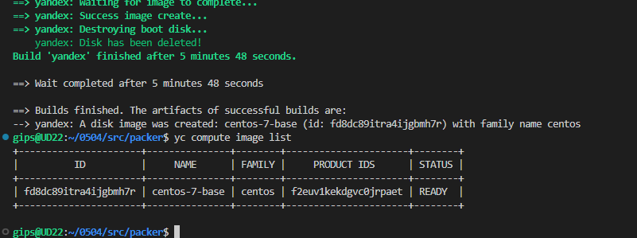
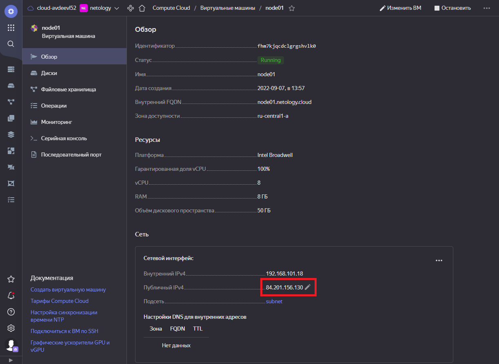
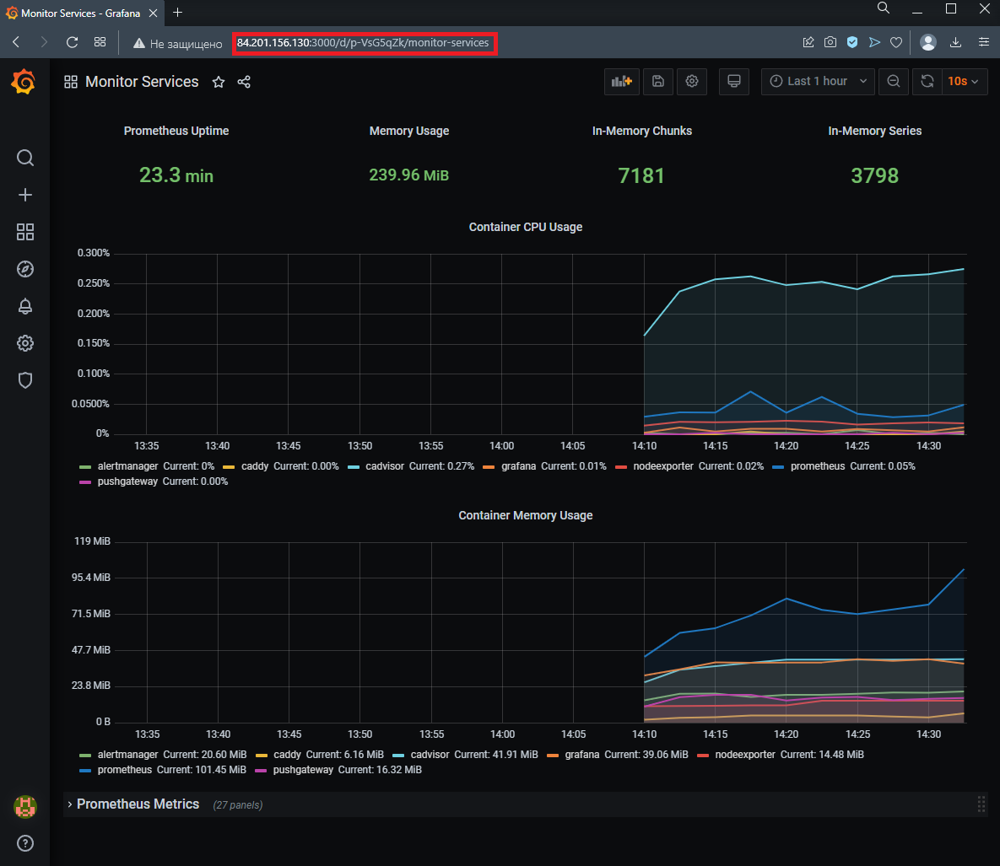

# Домашнее задание к занятию "5.4. Оркестрация группой Docker контейнеров на примере Docker Compose"

## Задача 1

Создать собственный образ операционной системы с помощью Packer.

Для получения зачета, вам необходимо предоставить:
- Скриншот страницы, как на слайде из презентации (слайд 37).


Ответ:  

<p align="center">
  
</p>

<details>
<summary>Логи выполнения:</summary>

Инициализация Yandex.Cloud

```sh
gips@UD22:~/0504/src$ yc init
Welcome! This command will take you through the configuration process.
Please choose folder to use:
 [1] netology (id = b1gssqpb8afmhvn13p0p)
 [2] Create a new folder
Please enter your numeric choice: 1
Your current folder has been set to 'netology' (id = b1gssqpb8afmhvn13p0p).
Do you want to configure a default Compute zone? [Y/n] Y
Which zone do you want to use as a profile default?
 [1] ru-central1-a
 [2] ru-central1-b
 [3] ru-central1-c
 [4] Don't set default zone
Please enter your numeric choice: 1
Your profile default Compute zone has been set to 'ru-central1-a'.
``` 

Создание сети

```sh
gips@UD22:~/0504/src$ yc vpc network create \
>     --name net \
>     --labels my-label=netology \
>     --description "my first network via yc"
id: enpsmedld2uthn1qc41a
folder_id: b1gssqpb8afmhvn13p0p
created_at: "2022-09-07T10:06:55Z"
name: net
description: my first network via yc
labels:
  my-label: netology
```

Создание подсети

```sh
gips@UD22:~/0504/src$ yc vpc subnet create \
>     --name my-subnet-a \
>     --zone ru-central1-a \
>     --range 10.1.2.0/24 \
>     --network-name net \
>     --description "my first subnet via yc"
id: e9b8jl7kv8kd06t84r44
folder_id: b1gssqpb8afmhvn13p0p
created_at: "2022-09-07T10:10:41Z"
name: my-subnet-a
description: my first subnet via yc
network_id: enpsmedld2uthn1qc41a
zone_id: ru-central1-a
v4_cidr_blocks:
  - 10.1.2.0/24
```


Проверяем конфигурационный файл
```sh
gips@UD22:~/0504/src/packer$ packer validate centos-7-base.json
The configuration is valid.
```

Создаем образ виртуальной машины
```sh
gips@UD22:~/0504/src/packer$ packer build centos-7-base.json
yandex: output will be in this color.

==> yandex: Creating temporary RSA SSH key for instance...
==> yandex: Using as source image: fd88d14a6790do254kj7 (name: "centos-7-v20220620", family: "centos-7")
==> yandex: Use provided subnet id e9b8jl7kv8kd06t84r44
==> yandex: Creating disk...
...
==> yandex: Destroying boot disk...
    yandex: Disk has been deleted!
Build 'yandex' finished after 5 minutes 48 seconds.

==> Wait completed after 5 minutes 48 seconds

==> Builds finished. The artifacts of successful builds are:
--> yandex: A disk image was created: centos-7-base (id: fd8dc89itra4ijgbmh7r) with family name centos

```

Проверяем

```sh
gips@UD22:~/0504/src/packer$ yc compute image list
+----------------------+---------------+--------+----------------------+--------+
|          ID          |     NAME      | FAMILY |     PRODUCT IDS      | STATUS |
+----------------------+---------------+--------+----------------------+--------+
| fd8dc89itra4ijgbmh7r | centos-7-base | centos | f2euv1kekdgvc0jrpaet | READY  |
+----------------------+---------------+--------+----------------------+--------+

```

Удаляем сеть и подсеть

```ssh
gips@UD22:~/0504/src/packer$ yc vpc subnet delete --name my-subnet-a
done (5s)
gips@UD22:~/0504/src/packer$ yc vpc network delete --name net
```

</details>


## Задача 2

Создать вашу первую виртуальную машину в Яндекс.Облаке.

Для получения зачета, вам необходимо предоставить:
- Скриншот страницы свойств созданной ВМ, как на примере ниже:

<p align="center">
  
</p>


Ответ:  

<p align="center">
  
</p>

<details>
  <summary>Логи выполнения:</summary>
Создаем файл с ключами

```sh
gips@UD22:~/0504/src/packer$ yc iam key create --service-account-name netology-service-account --output key.json
id: ajeaqgdcq9ln6fb1xxxx
service_account_id: ajeesfb0shaf2s0hxxxx
```

Инициализируем Terraform
```sh
gips@UD22:~/0504/src/terraform$ terraform init

Initializing the backend...

Initializing provider plugins...
- Finding latest version of yandex-cloud/yandex...
- Installing yandex-cloud/yandex v0.78.1...
- Installed yandex-cloud/yandex v0.78.1 (self-signed, key ID E40F590B50BB8E40)

Partner and community providers are signed by their developers.
If you d like to know more about provider signing, you can read about it here:
https://www.terraform.io/docs/cli/plugins/signing.html

Terraform has created a lock file .terraform.lock.hcl to record the provider
selections it made above. Include this file in your version control repository
so that Terraform can guarantee to make the same selections by default when
you run "terraform init" in the future.

Terraform has been successfully initialized!

You may now begin working with Terraform. Try running "terraform plan" to see
any changes that are required for your infrastructure. All Terraform commands
should now work.

If you ever set or change modules or backend configuration for Terraform,
rerun this command to reinitialize your working directory. If you forget, other
commands will detect it and remind you to do so if necessary.
gips@UD22:~/0504/src/terraform$ 
```

Выполняем terraform plan:

```sh
gips@UD22:~/0504/src/terraform$ terraform plan

Terraform used the selected providers to generate the following execution plan. Resource actions are indicated with the following symbols:
  + create

Terraform will perform the following actions:

  # yandex_compute_instance.node01 will be created
  + resource "yandex_compute_instance" "node01" {
      + allow_stopping_for_update = true
...
Plan: 3 to add, 0 to change, 0 to destroy.

Changes to Outputs:
  + external_ip_address_node01_yandex_cloud = (known after apply)
  + internal_ip_address_node01_yandex_cloud = (known after apply)

────────────────────────────────────────────────────────────────────────────────────────────────────────────────────────────────────────────────

Note: You didn't use the -out option to save this plan, so Terraform can't guarantee to take exactly these actions if you run "terraform apply"
now.
gips@UD22:~/0504/src/terraform$
```

Выполняем terraform apply:
```sh
gips@UD22:~/0504/src/terraform$ terraform apply --auto-approve

Terraform used the selected providers to generate the following execution plan. Resource actions are indicated with the following symbols:
  + create

Terraform will perform the following actions:

  # yandex_compute_instance.node01 will be created
  + resource "yandex_compute_instance" "node01" {
...

Apply complete! Resources: 3 added, 0 changed, 0 destroyed.

Outputs:

external_ip_address_node01_yandex_cloud = "84.201.156.130"
internal_ip_address_node01_yandex_cloud = "192.168.101.18"
```
</details>

## Задача 3

Создать ваш первый готовый к боевой эксплуатации компонент мониторинга, состоящий из стека микросервисов.

Для получения зачета, вам необходимо предоставить:
- Скриншот работающего веб-интерфейса Grafana с текущими метриками, как на примере ниже
<p align="center">
  
</p>

Ответ:  

<p align="center">
  
</p>

<details>
<summary>Логи выполнения:</summary>

Запускаем ansible-playbook:
```sh
gips@UD22:~/0504/src/ansible$ ansible-playbook provision.yml

PLAY [nodes] *****************************************************************************************************************************************************

TASK [Gathering Facts] *******************************************************************************************************************************************
The authenticity of host '84.201.156.130 (84.201.156.130)' can't be established.

****************************************
node01.netology.cloud      : ok=12   changed=10   unreachable=0    failed=0    skipped=0    rescued=0    ignored=0   
```

</details>

---
После выполнения задания удаляем виртуальную машину

```sh
gips@UD22:~/0504/src/terraform$ terraform destroy --auto-approve
yandex_vpc_network.default: Refreshing state... [id=enpvr60puupm8emk62ff]
yandex_vpc_subnet.default: Refreshing state... [id=e9bdi2loth1ro6mk539o]
yandex_compute_instance.node01: Refreshing state... [id=fhm7kjqcdclgrgshvlk0]

Terraform used the selected providers to generate the following execution plan. Resource actions are indicated with the following symbols:
  - destroy

Terraform will perform the following actions:

  # yandex_compute_instance.node01 will be destroyed
Plan: 0 to add, 0 to change, 3 to destroy
...
Changes to Outputs:
  - external_ip_address_node01_yandex_cloud = "84.201.156.130" -> null
  - internal_ip_address_node01_yandex_cloud = "192.168.101.18" -> null
yandex_compute_instance.node01: Destroying... [id=fhm7kjqcdclgrgshvlk0]
yandex_compute_instance.node01: Still destroying... [id=fhm7kjqcdclgrgshvlk0, 10s elapsed]
yandex_compute_instance.node01: Still destroying... [id=fhm7kjqcdclgrgshvlk0, 20s elapsed]
yandex_compute_instance.node01: Destruction complete after 28s
yandex_vpc_subnet.default: Destroying... [id=e9bdi2loth1ro6mk539o]
yandex_vpc_subnet.default: Destruction complete after 8s
yandex_vpc_network.default: Destroying... [id=enpvr60puupm8emk62ff]
yandex_vpc_network.default: Destruction complete after 0s

Destroy complete! Resources: 3 destroyed.
```
