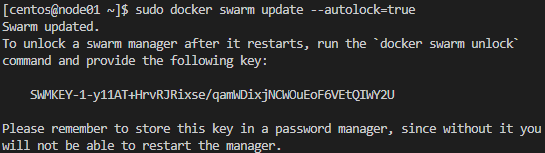

# Домашнее задание к занятию "5.5. Оркестрация кластером Docker контейнеров на примере Docker Swarm"

## Задача 1

Дайте письменые ответы на следующие вопросы:

- В чём отличие режимов работы сервисов в Docker Swarm кластере: replication и global?
- Какой алгоритм выбора лидера используется в Docker Swarm кластере?
- Что такое Overlay Network?


Ответ:  
1. В чём отличие режимов работы сервисов в Docker Swarm кластере: replication и global?  
   - В режиме replicated сервисы запускаются и автоматически поддерживается в диспетчере Docker Swarm в случае отказа в том количестве экземпляров которое заданно в конфигурации.
   - В режиме global сервис запускается обязательно на каждой ноде и в единственном экземпляре.

2. Какой алгоритм выбора лидера используется в Docker Swarm кластере?  
  Для выборов лидера применяется Raft - алгоритм консенсуса.
     - Протокол решает проблему согласованности - чтобы все manager-ноды имели одинаковое представление о состоянии кластера
     - Для отказоустойчивой работы должно быть не менее трёх manager-нод.
     - Количество нод обязательно должно быть нечётным, но лучше не более 7 (рекомендация из документации Docker).
     - Среди manager-нод выбирается лидер, его задача гарантировать согласованность.
     - Лидер отправляет keepalive-пакеты с заданной периодичностью в пределах 150-300мс. Если пакеты не пришли менеджеры начинают выборы нового лидера.
     - Если кластер разбит, нечётное количество нод должно гарантировать, что кластер останется консистентным, т.к факт изменения состояния считается совершенным, если его отразило большинство нод. Если разбить кластер пополам, нечётное число гарантирует, что в какой-то части кластера будет большинство нод.

3. Что такое Overlay Network?  
  Overlay Network - виртуальная сеть работающая поверх физической сети хоста и позволяет контейнерам безопасно обмениваться данными (с использованием сертификатов и шифрования). Docker маршрутизирует пакеты к нужному хосту и контейнеру.

## Задача 2

Создать ваш первый Docker Swarm кластер в Яндекс.Облаке

Для получения зачета, вам необходимо предоставить скриншот из терминала (консоли), с выводом команды:
```
docker node ls
```


Ответ:  

<p align="center">
  
</p>

<p align="center">
  
</p>

## Задача 3

Создать ваш первый, готовый к боевой эксплуатации кластер мониторинга, состоящий из стека микросервисов.

Для получения зачета, вам необходимо предоставить скриншот из терминала (консоли), с выводом команды:
```
docker service ls
```


Ответ:  

<p align="center">
  
</p>

<p align="center">
  
</p>


## Задача 4 (*)

Выполнить на лидере Docker Swarm кластера команду (указанную ниже) и дать письменное описание её функционала, что она делает и зачем она нужна:
```
# см.документацию: https://docs.docker.com/engine/swarm/swarm_manager_locking/
docker swarm update --autolock=true
```


Ответ:  

```docker swarm update --autolock=true```  
Данная команда включает автоблокировку кластера Docker Swarm.  
Это сделано в целях безопасности.  
После активации данного механизма после перезагрузки кластер не сможет автоматически запуститься, необходимо вводить ключ шифрования.

<p align="center">
  
</p>