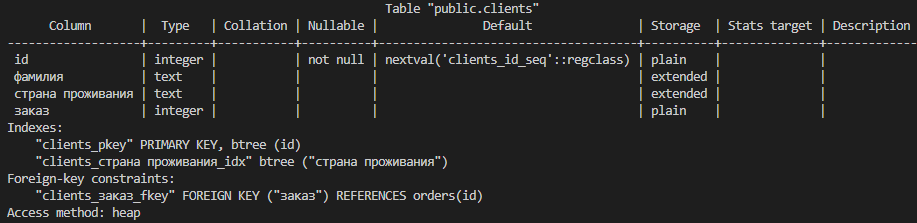

# Домашнее задание к занятию "6.2. SQL"

## Задача 1

Используя docker поднимите инстанс PostgreSQL (версию 12) c 2 volume, 
в который будут складываться данные БД и бэкапы.

Приведите получившуюся команду или docker-compose манифест.

Ответ:  

[docker-compose.yaml](./06-db-02-sql/assets/docker-compose.yaml)
```Docker
version: "3.9"

networks:
  postgres:
    driver: bridge

services:
  postgres:
    image: postgres:12
    container_name: postgres
    volumes:
      - ./data:/var/lib/postgresql/data
      - ./backup:/var/lib/postgresql/backup
    environment:
      POSTGRES_USER: "postgres"
      POSTGRES_PASSWORD: "password"
    ports:
      - 5432:5432
    networks:
      - postgres
```

<details>
<summary>Запускаем и проверяем </summary>

- `docker compose up -d`  
  
- `docker compose ps`
 
- `docker exec -it postgres bash`

- `psql -U postgres`  
- `\l` 

</details>


## Задача 2

В БД из задачи 1: 
- создайте пользователя test-admin-user и БД test_db
- в БД test_db создайте таблицу orders и clients (спeцификация таблиц ниже)
- предоставьте привилегии на все операции пользователю test-admin-user на таблицы БД test_db
- создайте пользователя test-simple-user  
- предоставьте пользователю test-simple-user права на SELECT/INSERT/UPDATE/DELETE данных таблиц БД test_db

Таблица orders:
- id (serial primary key)
- наименование (string)
- цена (integer)

Таблица clients:
- id (serial primary key)
- фамилия (string)
- страна проживания (string, index)
- заказ (foreign key orders)

Приведите:
- итоговый список БД после выполнения пунктов выше,
- описание таблиц (describe)
- SQL-запрос для выдачи списка пользователей с правами над таблицами test_db
- список пользователей с правами над таблицами test_db

Ответ:  

- создаем пользователя test-admin-user
```SQL
CREATE USER "test-admin-user" WITH LOGIN;
```

- создаем БД test_db
```SQL
CREATE DATABASE test_db;
```
- в БД test_db создаем таблицу orders
```SQL
CREATE TABLE orders (
	id SERIAL PRIMARY KEY, 
	наименование TEXT, 
	цена INT
);
```
- в БД test_db создаем таблицу clients
```SQL
CREATE TABLE clients (
	id SERIAL PRIMARY KEY, 
	фамилия TEXT, 
	"страна проживания" TEXT, 
	заказ INT REFERENCES orders (id)
);
CREATE INDEX ON clients ("страна проживания");
```

- предоставляем привилегии на все операции пользователю test-admin-user на таблицы БД test_db
```SQL
GRANT ALL ON TABLE clients, orders TO "test-admin-user";
```

- создаем пользователя test-simple-user  
```SQL
CREATE USER "test-simple-user" WITH LOGIN;
```

- предоставляем пользователю test-simple-user права на SELECT/INSERT/UPDATE/DELETE данных таблиц БД test_db
```SQL
GRANT SELECT,INSERT,UPDATE,DELETE ON TABLE clients,orders TO "test-simple-user";
```


- итоговый список БД после выполнения пунктов выше,


- описание таблиц (describe)  

  

  

- SQL-запрос для выдачи списка пользователей с правами над таблицами test_db  

```sql
SELECT table_name, array_agg(privilege_type), grantee
FROM information_schema.table_privileges
WHERE table_name = 'orders' OR table_name = 'clients'
GROUP BY table_name, grantee ;
```

- список пользователей с правами над таблицами test_db


## Задача 3

Используя SQL синтаксис - наполните таблицы следующими тестовыми данными:

Таблица orders

|Наименование|цена|
|------------|----|
|Шоколад| 10 |
|Принтер| 3000 |
|Книга| 500 |
|Монитор| 7000|
|Гитара| 4000|

Таблица clients

|ФИО|Страна проживания|
|------------|----|
|Иванов Иван Иванович| USA |
|Петров Петр Петрович| Canada |
|Иоганн Себастьян Бах| Japan |
|Ронни Джеймс Дио| Russia|
|Ritchie Blackmore| Russia|

Используя SQL синтаксис:
- вычислите количество записей для каждой таблицы 
- приведите в ответе:
    - запросы 
    - результаты их выполнения.

Ответ:  

- Наполняем таблицы следующими тестовыми данными:
```SQL
INSERT INTO orders (наименование, цена )
VALUES 
    ('Шоколад', '10'),
    ('Принтер', '3000'),
    ('Книга', '500'),
    ('Монитор', '7000'),
    ('Гитара', '4000')
;
```


```SQL
INSERT INTO clients ("фамилия", "страна проживания")
VALUES 
    ('Иванов Иван Иванович', 'USA'),
    ('Петров Петр Петрович', 'Canada'),
    ('Иоганн Себастьян Бах', 'Japan'),
    ('Ронни Джеймс Дио', 'Russia'),
    ('Ritchie Blackmore', 'Russia')
;
```


Вычисляем количество записей для каждой таблицы 
- запрос
```SQL
SELECT 'orders' AS name_table,  COUNT(*) AS number_rows FROM orders
UNION ALL
SELECT 'clients' AS name_table,  COUNT(*) AS number_rows  FROM clients;
```
- результаты их выполнения.


## Задача 4

Часть пользователей из таблицы clients решили оформить заказы из таблицы orders.

Используя foreign keys свяжите записи из таблиц, согласно таблице:

|ФИО|Заказ|
|------------|----|
|Иванов Иван Иванович| Книга |
|Петров Петр Петрович| Монитор |
|Иоганн Себастьян Бах| Гитара |

Приведите SQL-запросы для выполнения данных операций.

Приведите SQL-запрос для выдачи всех пользователей, которые совершили заказ, а также вывод данного запроса.
 
Подсказка - используйте директиву `UPDATE`.

Ответ:  
Связываем записи из таблиц:

```SQL
UPDATE clients SET "заказ" = (SELECT id FROM orders WHERE "наименование"='Книга') WHERE "фамилия"='Иванов Иван Иванович';
UPDATE clients SET "заказ" = (SELECT id FROM orders WHERE "наименование"='Монитор') WHERE "фамилия"='Петров Петр Петрович';
UPDATE clients SET "заказ" = (SELECT id FROM orders WHERE "наименование"='Гитара') WHERE "фамилия"='Иоганн Себастьян Бах';
```

SQL-запрос для выдачи всех пользователей, которые совершили заказ, а также вывод данного запроса.
```SQL
SELECT * FROM clients
WHERE "заказ" IS NOT null;
```


## Задача 5

Получите полную информацию по выполнению запроса выдачи всех пользователей из задачи 4 
(используя директиву EXPLAIN).

Приведите получившийся результат и объясните что значат полученные значения.

Ответ:  

```SQL
EXPLAIN SELECT * FROM clients
WHERE "заказ" IS NOT null;
```


|Значение|Определение|
|------------|----|
|clients| читаем последовательно данные из таблицы.|
|0.00| стоимость получения первого значения|
|18.10| стоимость получения всех строк  |
|806| приблизительное количество проверенных строк|
|72 | средний размер каждой строки в байтах составил |
|"заказ" IS NOT NULL|фильтр |


## Задача 6

Создайте бэкап БД test_db и поместите его в volume, предназначенный для бэкапов (см. Задачу 1).

Остановите контейнер с PostgreSQL (но не удаляйте volumes).

Поднимите новый пустой контейнер с PostgreSQL.

Восстановите БД test_db в новом контейнере.

Приведите список операций, который вы применяли для бэкапа данных и восстановления. 

Ответ:  
- Создаем бэкап БД test_db:  
`pg_dump -U postgres -Fc test_db > /var/lib/postgresql/backup/test_db.dump` 

В новом контейнере
- Перед восстановлениям БД добавляем пользователей:  
```sql
CREATE USER "test-admin-user" WITH LOGIN;
CREATE USER "test-simple-user" WITH LOGIN;
``` 
- Восстанавливаем из бэкапа БД test_db:  
`pg_restore -U postgres --verbose -C -d postgres /var/lib/postgresql/backup/test.dump`


<details>
<summary>Логи выполнения восстановления БД test_bd:</summary>

```sh
gips@UD22:/$ docker exec -it postgres bash
root@359cc0b482d1:/# psql -U postgres
psql (12.12 (Debian 12.12-1.pgdg110+1))
Type "help" for help.

postgres=# \l
                                 List of databases
   Name    |  Owner   | Encoding |  Collate   |   Ctype    |   Access privileges   
-----------+----------+----------+------------+------------+-----------------------
 postgres  | postgres | UTF8     | en_US.utf8 | en_US.utf8 | 
 template0 | postgres | UTF8     | en_US.utf8 | en_US.utf8 | =c/postgres          +
           |          |          |            |            | postgres=CTc/postgres
 template1 | postgres | UTF8     | en_US.utf8 | en_US.utf8 | =c/postgres          +
           |          |          |            |            | postgres=CTc/postgres
(3 rows)

postgres=# CREATE USER "test-admin-user" WITH LOGIN;
CREATE ROLE
postgres=# CREATE USER "test-simple-user" WITH LOGIN;
CREATE ROLE
postgres=# \q
root@359cc0b482d1:/# pg_restore -U postgres --verbose -C -d postgres /var/lib/postgresql/backup/test_db.dump
pg_restore: connecting to database for restore
pg_restore: creating DATABASE "test_db"
pg_restore: connecting to new database "test_db"
pg_restore: creating TABLE "public.clients"
pg_restore: creating SEQUENCE "public.clients_id_seq"
pg_restore: creating SEQUENCE OWNED BY "public.clients_id_seq"
pg_restore: creating TABLE "public.orders"
pg_restore: creating SEQUENCE "public.orders_id_seq"
pg_restore: creating SEQUENCE OWNED BY "public.orders_id_seq"
pg_restore: creating DEFAULT "public.clients id"
pg_restore: creating DEFAULT "public.orders id"
pg_restore: processing data for table "public.clients"
pg_restore: processing data for table "public.orders"
pg_restore: executing SEQUENCE SET clients_id_seq
pg_restore: executing SEQUENCE SET orders_id_seq
pg_restore: creating CONSTRAINT "public.clients clients_pkey"
pg_restore: creating CONSTRAINT "public.orders orders_pkey"
pg_restore: creating INDEX "public.clients_страна проживания_idx"
pg_restore: creating FK CONSTRAINT "public.clients clients_заказ_fkey"
pg_restore: creating ACL "public.TABLE clients"
pg_restore: creating ACL "public.TABLE orders"
root@359cc0b482d1:/# psql -U postgres
psql (12.12 (Debian 12.12-1.pgdg110+1))
Type "help" for help.

postgres=# \l
                                 List of databases
   Name    |  Owner   | Encoding |  Collate   |   Ctype    |   Access privileges   
-----------+----------+----------+------------+------------+-----------------------
 postgres  | postgres | UTF8     | en_US.utf8 | en_US.utf8 | 
 template0 | postgres | UTF8     | en_US.utf8 | en_US.utf8 | =c/postgres          +
           |          |          |            |            | postgres=CTc/postgres
 template1 | postgres | UTF8     | en_US.utf8 | en_US.utf8 | =c/postgres          +
           |          |          |            |            | postgres=CTc/postgres
 test_db   | postgres | UTF8     | en_US.utf8 | en_US.utf8 | 
(4 rows)

postgres=# \c test_db
You are now connected to database "test_db" as user "postgres".
test_db=# \d orders
                               Table "public.orders"
    Column    |  Type   | Collation | Nullable |              Default               
--------------+---------+-----------+----------+------------------------------------
 id           | integer |           | not null | nextval('orders_id_seq'::regclass)
 наименование | text    |           |          | 
 цена         | integer |           |          | 
Indexes:
    "orders_pkey" PRIMARY KEY, btree (id)
Referenced by:
    TABLE "clients" CONSTRAINT "clients_заказ_fkey" FOREIGN KEY ("заказ") REFERENCES orders(id)

test_db=# SELECT *
FROM clients
WHERE "заказ" IS NOT null;
 id |       фамилия        | страна проживания | заказ 
----+----------------------+-------------------+-------
  1 | Иванов Иван Иванович | USA               |     3
  2 | Петров Петр Петрович | Canada            |     4
  3 | Иоганн Себастьян Бах | Japan             |     5
(3 rows)

test_db=# 
```
</details>
