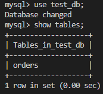

# Домашнее задание к занятию "6.3. MySQL"

## Задача 1

Используя docker поднимите инстанс MySQL (версию 8). Данные БД сохраните в volume.

Изучите [бэкап БД](https://github.com/netology-code/virt-homeworks/tree/master/06-db-03-mysql/test_data) и 
восстановитесь из него.

Перейдите в управляющую консоль `mysql` внутри контейнера.

Используя команду `\h` получите список управляющих команд.

Найдите команду для выдачи статуса БД и **приведите в ответе** из ее вывода версию сервера БД.

Подключитесь к восстановленной БД и получите список таблиц из этой БД.

**Приведите в ответе** количество записей с `price` > 300.

В следующих заданиях мы будем продолжать работу с данным контейнером.


Ответ:  

- Используя docker поднимаем инстанс MySQL (версию 8). Данные БД сохраните в volume.  
  
[docker-compose.yaml](./assets/docker-compose.yml)

```Docker
version: '3.5'
services:
  mysql:
    image: mysql:8
    environment:
      - MYSQL_ROOT_PASSWORD=root
    volumes:
      - ./data:/var/lib/mysql
      - ./backup:/data/backup/mysql
    ports:
      - "3306:3306"
    restart: always
```
- Используя docker поднимаем инстанс MySQL  
`docker-compose  ps`  

- Заходим в контейнер  
`docker exec -it mysql-mysql-1 bash`  

- Восстанавливаем Бэкап  
`mysql -u root -p test_db < /data/backup/mysql/test_dump.sql` 


- Переходим в управляющую консоль `mysql` внутри контейнера.  
`mysql -u root -p  `  

- Используя команду `\h` получаем список управляющих команд.  
`\h`  


- Находим команду для выдачи статуса БД  
  

- Подключаемся к восстановленной БД и получаем список таблиц из этой БД.  
`use test_db;`  
`show tables;`  



- Количество записей с `price` > 300.

```sql
SELECT count(*) FROM orders WHERE price > 300;
```


## Задача 2

Создайте пользователя test в БД c паролем test-pass, используя:
- плагин авторизации mysql_native_password
- срок истечения пароля - 180 дней 
- количество попыток авторизации - 3 
- максимальное количество запросов в час - 100
- аттрибуты пользователя:
    - Фамилия "Pretty"
    - Имя "James"

Предоставьте привелегии пользователю `test` на операции SELECT базы `test_db`.
    
Используя таблицу INFORMATION_SCHEMA.USER_ATTRIBUTES получите данные по пользователю `test` и 
**приведите в ответе к задаче**.


Ответ:  
- Создаем пользователя test
```sql
CREATE USER 'test'@'localhost'
IDENTIFIED WITH mysql_native_password BY 'test-pass' 
WITH MAX_QUERIES_PER_HOUR 100
PASSWORD EXPIRE INTERVAL 180 DAY
FAILED_LOGIN_ATTEMPTS 3
ATTRIBUTE '{"fname": "James", "lname": "Pretty"}';
```


- Предоставляем привелегии пользователю `test` на операции SELECT базы `test_db`.

```sql
GRANT SELECT ON test_db.* TO 'test'@'localhost';
```


- Используя таблицу INFORMATION_SCHEMA.USER_ATTRIBUTES получаем данные по пользователю `test`
```sql
SELECT * FROM INFORMATION_SCHEMA.USER_ATTRIBUTES WHERE USER = 'test';
```


## Задача 3

Установите профилирование `SET profiling = 1`.
Изучите вывод профилирования команд `SHOW PROFILES;`.

Исследуйте, какой `engine` используется в таблице БД `test_db` и **приведите в ответе**.

Измените `engine` и **приведите время выполнения и запрос на изменения из профайлера в ответе**:
- на `MyISAM`
- на `InnoDB`


Ответ:  
- Устанавливаем профилирование `SET profiling = 1`.
Изучаем вывод профилирования команд `SHOW PROFILES;`.
 

- В таблице БД test_db используется `engine` `InnoDB`  

```sql
SELECT table_schema,table_name,engine FROM information_schema.tables WHERE table_schema = DATABASE();
```

  

- Изменяем `engine` и приведем время выполнения  

на `MyISAM`:  
```sql
ALTER TABLE orders ENGINE = MyISAM;
```
на `InnoDB`: 
```sql
ALTER TABLE orders ENGINE = InnoDB;
```
  


## Задача 4 

Изучите файл `my.cnf` в директории /etc/mysql.

Измените его согласно ТЗ (движок InnoDB):
- Скорость IO важнее сохранности данных
- Нужна компрессия таблиц для экономии места на диске
- Размер буффера с незакомиченными транзакциями 1 Мб
- Буффер кеширования 30% от ОЗУ
- Размер файла логов операций 100 Мб

Приведите в ответе измененный файл `my.cnf`.


Ответ:  


```
[mysqld]
pid-file        = /var/run/mysqld/mysqld.pid
socket          = /var/run/mysqld/mysqld.sock
datadir         = /var/lib/mysql
secure-file-priv= NULL

# Custom config should go here
!includedir /etc/mysql/conf.d/

innodb_flush_method = O_DSYN        # Скорость IO важнее сохранности данных
innodb_file_per_table = 1           # Компрессия таблиц для экономии места на диске
innodb_log_buffer_size = 1M         # Размер буффера с незакомиченными транзакциями 1 Мб
innodb_buffer_pool_size = 9G        # Буффер кеширования 28% от ОЗУ 32GB
innodb_log_file_size = 100M         # Размер файла логов операций 100 Мб
```

---
