# Домашнее задание к занятию "6.4. PostgreSQL"

## Задача 1

Используя docker поднимите инстанс PostgreSQL (версию 13). Данные БД сохраните в volume.

Подключитесь к БД PostgreSQL используя `psql`.

Воспользуйтесь командой `\?` для вывода подсказки по имеющимся в `psql` управляющим командам.

**Найдите и приведите** управляющие команды для:
- вывода списка БД
- подключения к БД
- вывода списка таблиц
- вывода описания содержимого таблиц
- выхода из psql


Ответ:  

Используя docker поднимаем инстанс PostgreSQL (версию 13). Данные БД сохраняются в volume.
- `docker compose up -d`

```dockerfile
version: '3.5'
services:
  postgres:
    image: postgres:13
    environment:
      - POSTGRES_PASSWORD=postgres
      - POSTGRES_USER=postgres
    volumes:
      - ./data:/var/lib/postgresql/data
      - ./backup:/data/backup/postgres
    ports:
      - "5432:5432"
    restart: always
```

- Подключаемся к БД PostgreSQL используя `psql`.  
`psql -U postgres`  
- Используем команду `\?` для вывода подсказки по имеющимся в `psql` управляющим командам.  
`\?`  

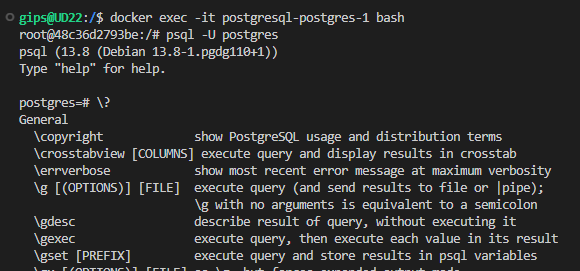

**Находим и приводим примеры** управляющих команды для:

- вывода списка БД
```
\l[+]   [PATTERN]      list databases
```
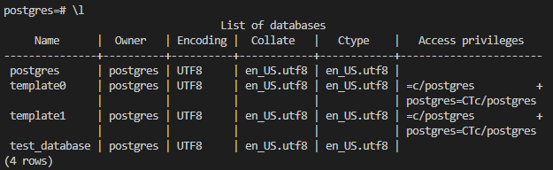

- подключения к БД
```
\c[onnect] {[DBNAME|- USER|- HOST|- PORT|-] | conninfo}
                         connect to new database (currently "postgres")
```

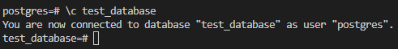

- вывода списка таблиц
```
\dt[S+] [PATTERN]      list tables
```

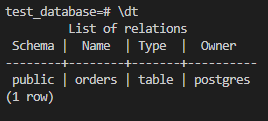


- вывода описания содержимого таблиц
```
\d[S+]  NAME           describe table, view, sequence, or index
```
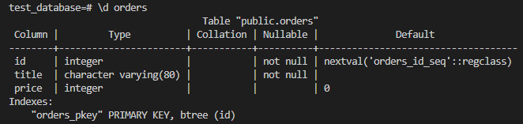

- выхода из psql
```
\q
```

## Задача 2

Используя `psql` создайте БД `test_database`.

Изучите [бэкап БД](https://github.com/netology-code/virt-homeworks/tree/master/06-db-04-postgresql/test_data).

Восстановите бэкап БД в `test_database`.

Перейдите в управляющую консоль `psql` внутри контейнера.

Подключитесь к восстановленной БД и проведите операцию ANALYZE для сбора статистики по таблице.

Используя таблицу [pg_stats](https://postgrespro.ru/docs/postgresql/12/view-pg-stats), найдите столбец таблицы `orders` 
с наибольшим средним значением размера элементов в байтах.


Ответ:  

- Используя `psql` создаем БД `test_database`.
```sql
CREATE DATABASE test_database;
```
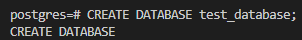

- Восстановливаем бэкап БД в `test_database`.
```sh
psql -U postgres test_database < /data/backup/postgres/test_dump.sql
```
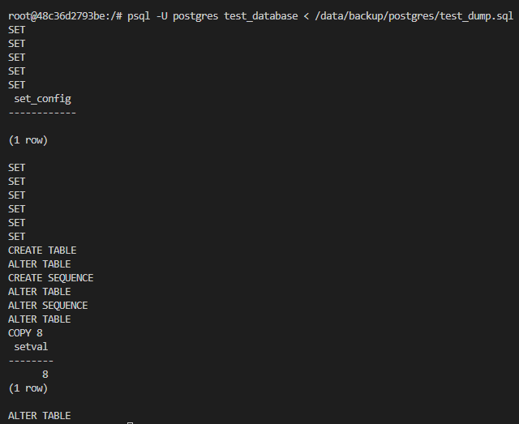

- Переходим в управляющую консоль `psql` внутри контейнера.  
```
psql -U postgres
```
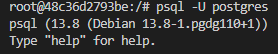


- Подключаемся к восстановленной БД
```sql
\c test_database
```


- Проводим операцию ANALYZE для сбора статистики по таблице.

```sql
ANALYZE VERBOSE public.orders;
```
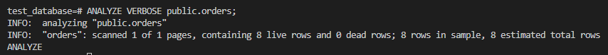

- Используя таблицу [pg_stats](https://postgrespro.ru/docs/postgresql/12/view-pg-stats), находим столбец таблицы `orders` с наибольшим средним значением размера элементов в байтах.
```sql
SELECT tablename, attname, avg_width 
FROM pg_stats 
WHERE avg_width 
IN (SELECT MAX(avg_width) 
FROM pg_stats 
WHERE tablename = 'orders') and tablename = 'orders';
```

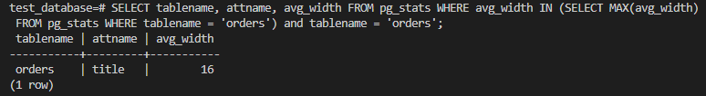

## Задача 3

Архитектор и администратор БД выяснили, что ваша таблица orders разрослась до невиданных размеров и
поиск по ней занимает долгое время. Вам, как успешному выпускнику курсов DevOps в нетологии предложили
провести разбиение таблицы на 2 (шардировать на orders_1 - price>499 и orders_2 - price<=499).

Предложите SQL-транзакцию для проведения данной операции.

Можно ли было изначально исключить "ручное" разбиение при проектировании таблицы orders?


Ответ:  

```sql
BEGIN;

-- Переименовываем таблицу в orders_old
ALTER TABLE orders RENAME TO orders_old;

-- Создаем пустую таблицу orders
CREATE TABLE orders AS table orders_old WITH NO DATA;

-- Создаем таблицы orders_1 и orders_2 с наследованием от orders с ограничения на значение ключа price
CREATE TABLE orders_1 (CHECK (price > 499)) INHERITS (orders);
CREATE TABLE orders_2 (CHECK (price <= 499)) INHERITS (orders);

-- Создаем правила на вставку в таблицу orders_1 с условием price > 499
CREATE RULE orders_1_insert AS ON INSERT TO orders 
WHERE  (price > 499) DO INSTEAD 
INSERT INTO orders_1 VALUES (NEW.*);

-- Создаем правила на вставку в таблицу orders_2 с условием price <= 499       
CREATE RULE orders_2_insert AS ON INSERT TO orders 
WHERE (price <= 499) DO INSTEAD 
INSERT INTO orders_2 VALUES (NEW.*);

-- Переносим данные из orders_old
INSERT INTO orders SELECT * FROM orders_old;

--Удаляем orders_old
DROP table orders_old;

COMMIT;
```
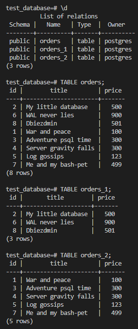


Для того чтобы изначально исключить "ручное" разбиение при проектировании таблицы orders должно было выполнено секционирование (Partitioning).  
```sql
CREATE TABLE orders (id integer NOT NULL,title character varying(80) NOT NULL,price integer DEFAULT 0) 
PARTITION BY RANGE (price);

CREATE TABLE orders_1 
PARTITION OF orders FOR VALUES GREATER THAN ('499');

CREATE TABLE orders_2 
PARTITION OF orders FOR VALUES FROM ('0') TO ('499');
```
## Задача 4

Используя утилиту `pg_dump` создайте бекап БД `test_database`.

Как бы вы доработали бэкап-файл, чтобы добавить уникальность значения столбца `title` для таблиц `test_database`?


Ответ:  
Используя утилиту `pg_dump` создаем бекап БД `test_database`.
```sh
pg_dump -U postgres -cv test_database > /data/backup/postgres/test_database_dump.sql
```
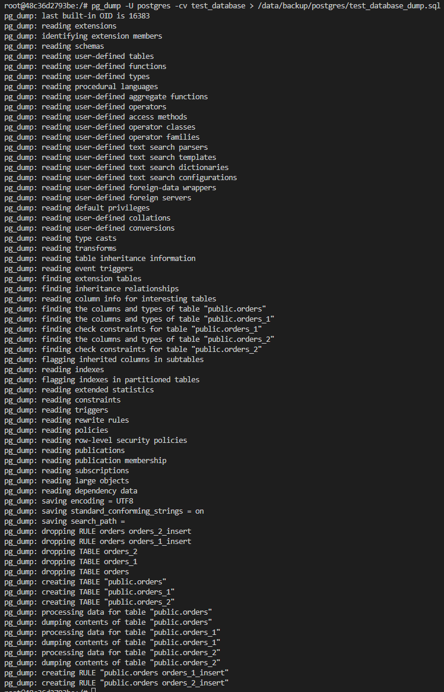


Добавляем критерий UNIQUE значения столбца `title` для таблиц `test_database`
```sql
CREATE TABLE public.orders (
    id integer NOT NULL,
    title character varying(80) UNIQUE NOT NULL,
    price integer DEFAULT 0
);
```

---

