# Домашнее задание к занятию "6.5. Elasticsearch"

## Задача 1

В этом задании вы потренируетесь в:
- установке elasticsearch
- первоначальном конфигурировании elastcisearch
- запуске elasticsearch в docker

Используя докер образ [centos:7](https://hub.docker.com/_/centos) как базовый и 
[документацию по установке и запуску Elastcisearch](https://www.elastic.co/guide/en/elasticsearch/reference/current/targz.html):

- составьте Dockerfile-манифест для elasticsearch
- соберите docker-образ и сделайте `push` в ваш docker.io репозиторий
- запустите контейнер из получившегося образа и выполните запрос пути `/` c хост-машины

Требования к `elasticsearch.yml`:
- данные `path` должны сохраняться в `/var/lib`
- имя ноды должно быть `netology_test`

В ответе приведите:
- текст Dockerfile манифеста
- ссылку на образ в репозитории dockerhub
- ответ `elasticsearch` на запрос пути `/` в json виде


Ответ:  

[Ссылка на образ](https://hub.docker.com/r/avdeevvl/elasticsearch)

[Dockerfile](./assets/Dockerfile)

```docker
FROM centos:7

EXPOSE 9200 9300

ENV ES_VER=8.4.1 

RUN cd /opt && \
    groupadd elasticsearch && \
    useradd -c "elasticsearch" -g elasticsearch elasticsearch &&\
    yum -y install wget && \
    wget https://artifacts.elastic.co/downloads/elasticsearch/elasticsearch-${ES_VER}-linux-x86_64.tar.gz && \
    wget https://artifacts.elastic.co/downloads/elasticsearch/elasticsearch-${ES_VER}-linux-x86_64.tar.gz.sha512 && \
    sha512sum -c elasticsearch-${ES_VER}-linux-x86_64.tar.gz.sha512 && \
    tar -xzf elasticsearch-${ES_VER}-linux-x86_64.tar.gz && \
        rm -f elasticsearch-${ES_VER}-linux-x86_64.tar.gz* && \
        mkdir /var/lib/data && chmod -R 777 /var/lib/data && \
	    chown -R elasticsearch:elasticsearch /opt/elasticsearch-${ES_VER} && \
    yum -y remove wget && \
    yum clean all

USER elasticsearch
WORKDIR /opt/elasticsearch-${ES_VER}/
COPY elasticsearch.yml  config/
ENTRYPOINT ["bin/elasticsearch"]
```

[elasticsearch.yml](./assets/elasticsearch.yml)
```yml
cluster.name: netology_test
discovery.type: single-node
path.data: /var/lib/data
network.host: 0.0.0.0
discovery.seed_hosts: ["127.0.0.1", "[::1]"]
xpack.ml.enabled: false
```

- ответ `elasticsearch` на запрос пути `/` в json виде  
  ```bash
  curl --insecure -u elastic https://localhost:9200
  ```  
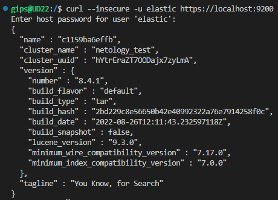


Далее мы будем работать с данным экземпляром elasticsearch.

## Задача 2

В этом задании вы научитесь:
- создавать и удалять индексы
- изучать состояние кластера
- обосновывать причину деградации доступности данных

Ознакомтесь с [документацией](https://www.elastic.co/guide/en/elasticsearch/reference/current/indices-create-index.html) 
и добавьте в `elasticsearch` 3 индекса, в соответствии со таблицей:

| Имя | Количество реплик | Количество шард |
|-----|-------------------|-----------------|
| ind-1| 0 | 1 |
| ind-2 | 1 | 2 |
| ind-3 | 2 | 4 |

Получите список индексов и их статусов, используя API и **приведите в ответе** на задание.

Получите состояние кластера `elasticsearch`, используя API.

Как вы думаете, почему часть индексов и кластер находится в состоянии yellow?

Удалите все индексы.

Ответ:  

- Добавляем в `elasticsearch` 3 индекса  
```bash
curl -X PUT --insecure -u elastic "https://localhost:9200/ind-1?pretty" -H 'Content-Type: application/json' -d'
{
  "settings": {
    "index": {
      "number_of_shards": 1,  
      "number_of_replicas": 0 
    }
  }
}
'
curl -X PUT --insecure -u elastic "https://localhost:9200/ind-2?pretty" -H 'Content-Type: application/json' -d'
{
  "settings": {
    "index": {
      "number_of_shards": 2,  
      "number_of_replicas": 1 
    }
  }
}
'
curl -X PUT --insecure -u elastic "https://localhost:9200/ind-3?pretty" -H 'Content-Type: application/json' -d'
{
  "settings": {
    "index": {
      "number_of_shards": 4,  
      "number_of_replicas": 2 
    }
  }
}
'
```
- Получаем список индексов и их статусов

```bash
curl -X GET --insecure -u elastic "https://localhost:9200/_cat/indices?v"
```
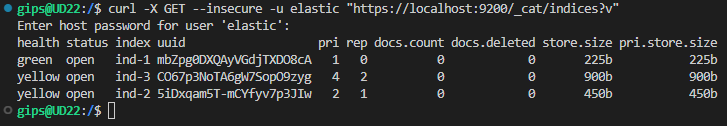

- Получаем состояние кластера `elasticsearch`  
```bash
curl -X GET --insecure -u elastic "https://localhost:9200/_cluster/health?pretty"
``` 
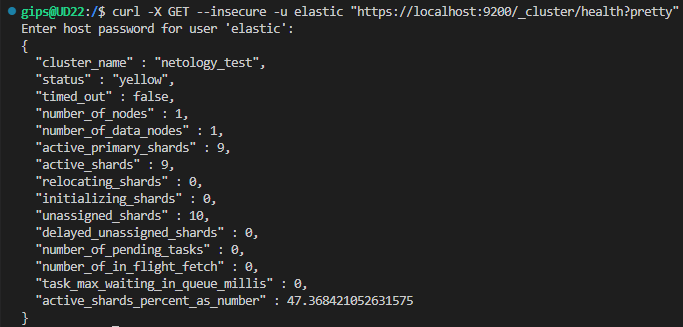

- Удаляем индексы
```bash
curl -X DELETE --insecure -u elastic "https://localhost:9200/ind-1?pretty"
curl -X DELETE --insecure -u elastic "https://localhost:9200/ind-2?pretty"
curl -X DELETE --insecure -u elastic "https://localhost:9200/ind-3?pretty"
```
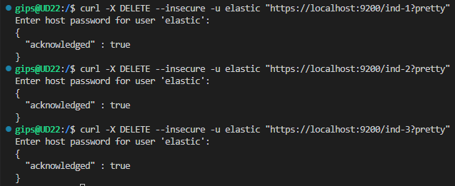

- Часть индексов и кластер находится в состоянии yellow так как индексы ind-2 и ind-3 не могут разместить свои шарды на других нодах кластера так как нода одна и она является master shard.


## Задача 3

В данном задании вы научитесь:
- создавать бэкапы данных
- восстанавливать индексы из бэкапов

Создайте директорию `{путь до корневой директории с elasticsearch в образе}/snapshots`.

Используя API [зарегистрируйте](https://www.elastic.co/guide/en/elasticsearch/reference/current/snapshots-register-repository.html#snapshots-register-repository) 
данную директорию как `snapshot repository` c именем `netology_backup`.

**Приведите в ответе** запрос API и результат вызова API для создания репозитория.

Создайте индекс `test` с 0 реплик и 1 шардом и **приведите в ответе** список индексов.

[Создайте `snapshot`](https://www.elastic.co/guide/en/elasticsearch/reference/current/snapshots-take-snapshot.html) 
состояния кластера `elasticsearch`.

**Приведите в ответе** список файлов в директории со `snapshot`ами.

Удалите индекс `test` и создайте индекс `test-2`. **Приведите в ответе** список индексов.

[Восстановите](https://www.elastic.co/guide/en/elasticsearch/reference/current/snapshots-restore-snapshot.html) состояние
кластера `elasticsearch` из `snapshot`, созданного ранее. 

**Приведите в ответе** запрос к API восстановления и итоговый список индексов.

Подсказки:
- возможно вам понадобится доработать `elasticsearch.yml` в части директивы `path.repo` и перезапустить `elasticsearch`


Ответ:  

- Создаем директорию добавляем права
- Дорабатываем `elasticsearch.yml` в части директивы `path.repo`

```bash
mkdir /opt/elasticsearch-8.4.1/snapshots
chown elasticsearch:elasticsearch /opt/elasticsearch-8.4.1/snapshots
echo path.repo: [ "/opt/elasticsearch-8.4.1/snapshots" ] >> "/opt/elasticsearch-8.4.1/config/elasticsearch.yml"
```
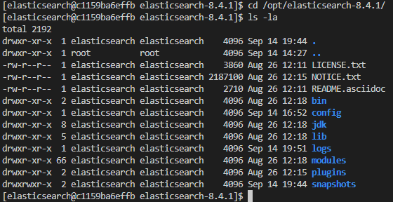


- Используя API регистрируем созданную директорию как `snapshot repository` c именем `netology_backup`.

```bash
curl -X PUT --insecure -u elastic "https://localhost:9200/_snapshot/netology_backup?pretty" -H 'Content-Type: application/json' -d'
{
  "type": "fs",
  "settings": {
    "location": "opt/elasticsearch-8.4.1/snapshots",
    "compress": true
  }
}'
```
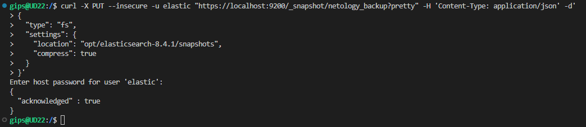

- Создаем индекс `test` с 0 реплик и 1 шардом

```bash
curl -X PUT  --insecure -u elastic "https://localhost:9200/test?pretty" -H 'Content-Type: application/json' -d'
{
  "settings": {
    "number_of_shards": 1,
    "number_of_replicas": 0
  }
}
'
curl  --insecure -u elastic 'https://localhost:9200/_cat/indices?v'
```
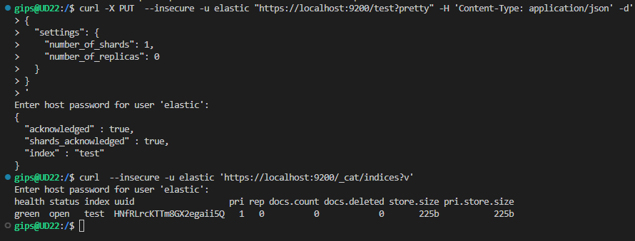


- Создаем `snapshot`
```bash
curl -X PUT --insecure -u elastic "https://localhost:9200/_snapshot/netology_backup/snapshot_1?wait_for_completion=true&pretty"
```
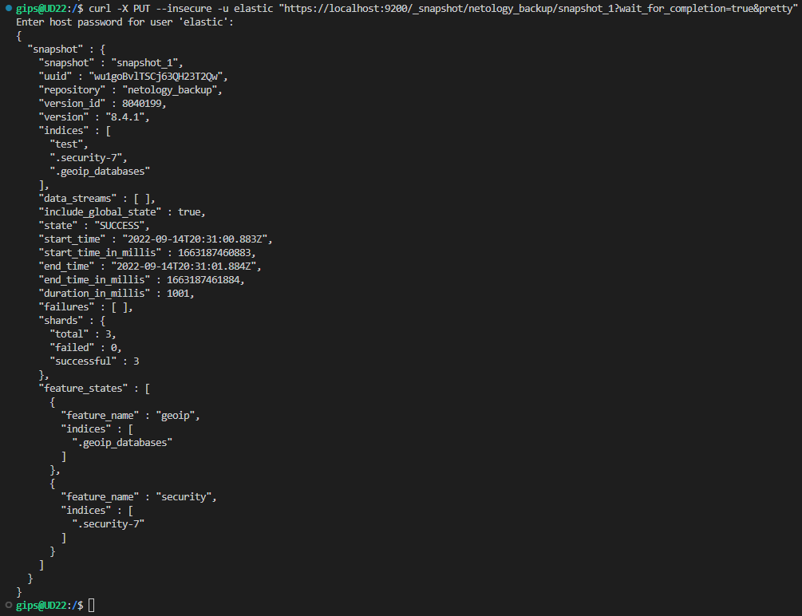  

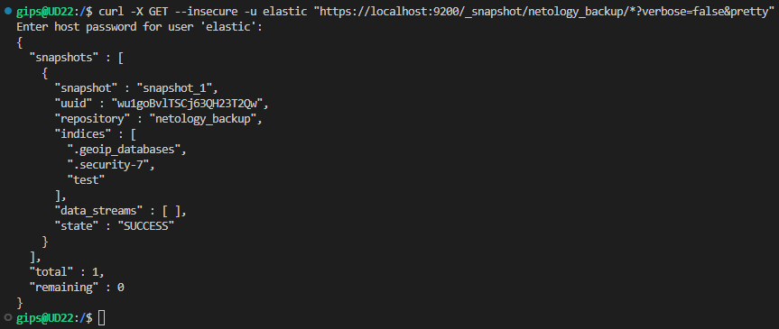

- Список файлов в директории со `snapshot`ами.  
  
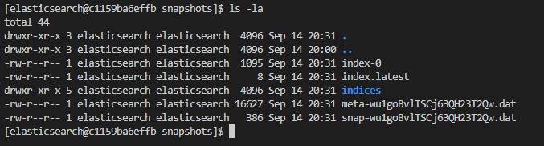


- Удаляем индекс `test` и создаем индекс `test-2`

```bash
curl -X DELETE  --insecure -u elastic "https://localhost:9200/test?pretty"
curl -X PUT  --insecure -u elastic "https://localhost:9200/test-2?pretty" -H 'Content-Type: application/json' -d'
{
  "settings": {
    "number_of_shards": 1,
    "number_of_replicas": 0
  }
}
'

curl  --insecure -u elastic 'https://localhost:9200/_cat/indices?pretty'
```
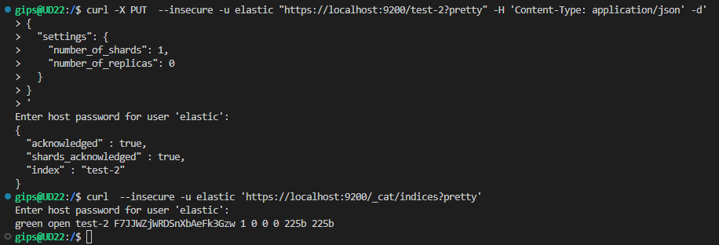


- Восстанавливаем состояние кластера `elasticsearch` из `snapshot`, созданного ранее.
```bash
curl -X POST --insecure -u elastic "https://localhost:9200/_snapshot/netology_backup/snapshot_1/_restore?pretty" -H 'Content-Type: application/json' -d'
{
  "indices": "*",
  "include_global_state": true
}
'
```

- Итоговый список индексов

```bash
curl -X GET --insecure -u elastic "https://localhost:9200/_cat/indices?v=true"

```
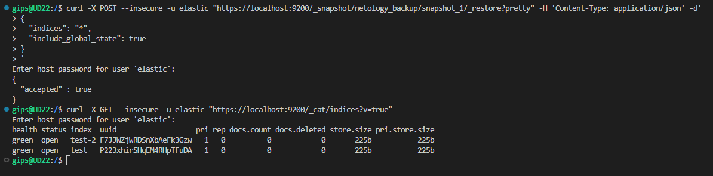


---
