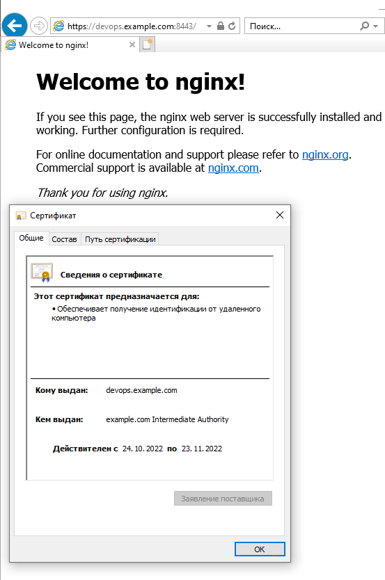
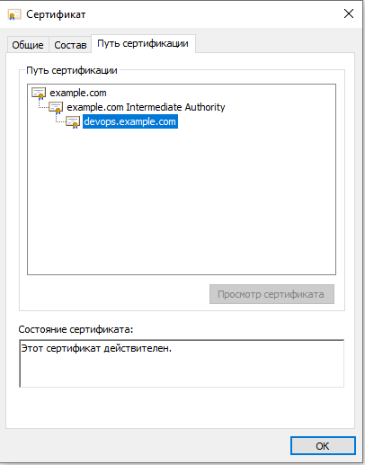
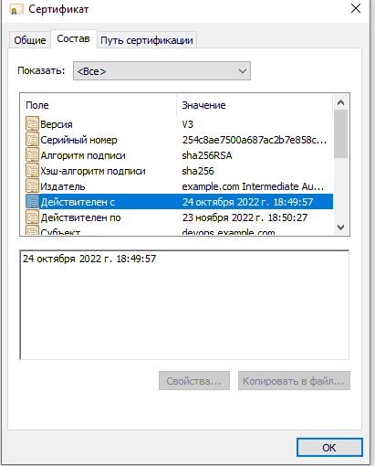
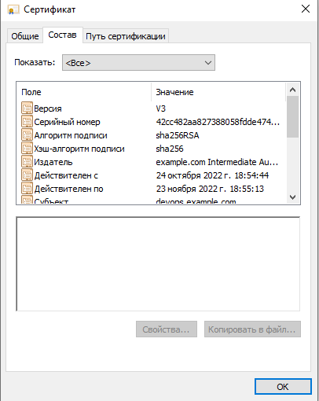

# Курсовая работа по итогам модуля "DevOps и системное администрирование"

Курсовая работа необходима для проверки практических навыков, полученных в ходе прохождения курса "DevOps и системное администрирование".

Мы создадим и настроим виртуальное рабочее место. Позже вы сможете использовать эту систему для выполнения домашних заданий по курсу

## Задание

1. Создайте виртуальную машину Linux.
2. Установите ufw и разрешите к этой машине сессии на порты 22 и 443, при этом трафик на интерфейсе localhost (lo) должен ходить свободно на все порты.
3. Установите hashicorp vault ([инструкция по ссылке](https://learn.hashicorp.com/tutorials/vault/getting-started-install?in=vault/getting-started#install-vault)).
4. Cоздайте центр сертификации по инструкции ([ссылка](https://learn.hashicorp.com/tutorials/vault/pki-engine?in=vault/secrets-management)) и выпустите сертификат для использования его в настройке веб-сервера nginx (срок жизни сертификата - месяц).
5. Установите корневой сертификат созданного центра сертификации в доверенные в хостовой системе.
6. Установите nginx.
7. По инструкции ([ссылка](https://nginx.org/en/docs/http/configuring_https_servers.html)) настройте nginx на https, используя ранее подготовленный сертификат:
  - можно использовать стандартную стартовую страницу nginx для демонстрации работы сервера;
  - можно использовать и другой html файл, сделанный вами;
8. Откройте в браузере на хосте https адрес страницы, которую обслуживает сервер nginx.
9. Создайте скрипт, который будет генерировать новый сертификат в vault:
  - генерируем новый сертификат так, чтобы не переписывать конфиг nginx;
  - перезапускаем nginx для применения нового сертификата.
10. Поместите скрипт в crontab, чтобы сертификат обновлялся какого-то числа каждого месяца в удобное для вас время.

---

1. Создайте виртуальную машину Linux.
Vagrantfile

```
Vagrant.configure("2") do |config|
    config.vm.box = "bento/ubuntu-21.10"
    config.vm.network "forwarded_port", guest: 80, host:8080
    config.vm.network "forwarded_port", guest: 443, host:8443
   config.vm.provider "virtualbox" do |v|
       v.memory = 2048
       v.cpus = 2
   end
end
 ```


2. Установите ufw и разрешите к этой машине сессии на порты 22 и 443, при этом трафик на интерфейсе localhost (lo) должен ходить свободно на все порты.

```bash
ufw --version
ufw 0.36.1
Copyright 2008-2021 Canonical Ltd.
```

```bash
sudo ufw default deny incoming
sudo ufw default allow outgoing
sudo ufw allow 22/tcp
sudo ufw allow 443/tcp
sudo ufw allow in on lo to any
sudo ufw enable
```

```bash
vagrant@vagrant:~$ sudo ufw status
Status: active

To                         Action      From
--                         ------      ----
22/tcp                     ALLOW       Anywhere                  
443/tcp                    ALLOW       Anywhere                  
Anywhere on lo             ALLOW       Anywhere                  
22/tcp (v6)                ALLOW       Anywhere (v6)             
443/tcp (v6)               ALLOW       Anywhere (v6)             
Anywhere (v6) on lo        ALLOW       Anywhere (v6)             
```

3. Установите hashicorp vault ([инструкция по ссылке](https://learn.hashicorp.com/tutorials/vault/getting-started-install?in=vault/getting-started#install-vault)).

```bash
curl -fsSL https://apt.releases.hashicorp.com/gpg | sudo apt-key add -
sudo apt-add-repository "deb [arch=amd64] https://apt.releases.hashicorp.com $(lsb_release -cs) main"
sudo apt-get update && sudo apt-get install vault
```

4. Создайте центр сертификации по инструкции (ссылка), и выпустите сертификат для использования его в настройке веб-сервера nginx (срок жизни сертификата - месяц).

Запускаем vault в dev режиме в отдельном терминале:  
`vault server -dev -dev-root-token-id root`

Создадим переменные окружения:
```
export VAULT_ADDR=http://127.0.0.1:8200
export VAULT_TOKEN=root
```
Создадим корневой сертификат :

```
vault secrets enable pki

vault secrets tune -max-lease-ttl=8760h pki

vault write -field=certificate pki/root/generate/internal common_name="example.com" ttl=87600h > CA_cert.crt

vault write pki/config/urls issuing_certificates="http://127.0.0.1:8200/v1/pki/ca" crl_distribution_points="http://127.0.0.1:8200/v1/pki/crl"
```


Создадим промежуточный сертификат:

```
vault secrets enable -path=pki_int pki

vault secrets tune -max-lease-ttl=8760h pki_int

apt install jq

vault write -format=json pki_int/intermediate/generate/internal common_name="example.com Intermediate Authority" | jq -r '.data.csr' > pki_intermediate.csr

vault write -format=json pki/root/sign-intermediate csr=@pki_intermediate.csr format=pem_bundle ttl="8760h" | jq -r '.data.certificate' > intermediate.cert.pem

vault write pki_int/intermediate/set-signed certificate=@intermediate.cert.pem
```

Создадим роль:
```
vault write pki_int/roles/example-dot-com allowed_domains="example.com" allow_subdomains=true max_ttl="4380h"

```

Запрашиваем данные сертификата сайта:
```
vault write -format=json pki_int/issue/example-dot-com common_name="devops.example.com" ttl=720h > devops.example.com.crt

cat devops.example.com.crt | jq -r .data.certificate > devops.example.com.crt.pem
cat devops.example.com.crt | jq -r .data.issuing_ca >> devops.example.com.crt.pem
cat devops.example.com.crt | jq -r .data.private_key > devops.example.com.crt.key
```
5. Установили корневой сертификат созданного центра сертификации в доверенные в хостовой системе.

6. Установите nginx.
```
apt install nginx
echo 127.0.0.1 devops.example.com | sudo tee --append /etc/hosts
```
7. По инструкции (ссылка) настройте nginx на https, используя ранее подготовленный сертификат:

Изменяем /etc/nginx/sites-enabled/default

```
        listen 443 ssl default_server;
        listen [::]:443 ssl default_server;
        ssl_certificate /root/devops.example.com.crt.pem;
        ssl_certificate_key /root/devops.example.com.crt.key;
```
Проверяем и перезапускаем nginx:
```
nginx -t
systemctl reload nginx
```
8. Откройте в браузере на хосте https адрес страницы, которую обслуживает сервер nginx.




9.  Создайте скрипт, который будет генерировать новый сертификат в vault:
  - генерируем новый сертификат так, чтобы не переписывать конфиг nginx;
  - перезапускаем nginx для применения нового сертификата.

update_ssl.sh
```
#!/bin/bash
vault write -format=json pki_int/issue/example-dot-com common_name="devops.example.com" ttl=720h > /root/devops.example.com.crt
cat /root/devops.example.com.crt | jq -r .data.certificate > /root/devops.example.com.crt.pem
cat /root/devops.example.com.crt | jq -r .data.issuing_ca >> /root/devops.example.com.crt.pem
cat /root/devops.example.com.crt | jq -r .data.private_key > /root/devops.example.com.crt.key
systemctl reload nginx
```
Проверяем:




10. Поместите скрипт в crontab, чтобы сертификат обновлялся какого-то числа каждого месяца в удобное для вас время.  
Запуск 24 числа каждого месяца в 22:00
```
sudo crontab -e

00 22 24 * * /root/update_ssl.sh
```